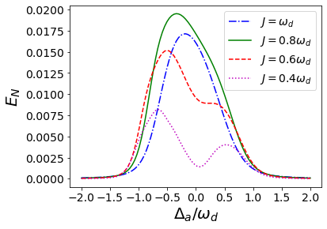

::: titlepage
::: center
**Entanglement in Coupled Cavity Magnomechanics**

{width="40%"}

**Dilawaiz**

**2022**

Department of Physics and Applied Mathematics\
Pakistan Institute of Engineering and Applied Sciences\
Nilore, Islamabad, Pakistan\
:::
:::

::: center
This page is intentionally left blank.
:::

::: center
**Certificate of Approval**\
:::

This is to certify that the work contained in this thesis entitled
**Entanglement in Hybrid Cavity System**, was carried out by
**Dilawaiz**, and in my opinion, it is fully adequate, in scope and
quality, for the degree of **Bachelors**. Furthermore, it is hereby
approved for submission for review and thesis defense.\

::: flushright
Supervisor:

------------------------------------------------------------------------

\
Name: **Dr. Muhammad Irfan**\
Date: 24 June, 2022\
Place: PIEAS, Islamabad\
Co-Supervisor:

------------------------------------------------------------------------

\
Name: **Dr. Shahid Qamar**\
Date: 24 June, 2022\
Place: PIEAS, Islamabad\
Head, DPAM:

------------------------------------------------------------------------

\
Name: **Dr. Aftab Rafique**\
Date: 24 June, 2022\
Place: PIEAS, Islamabad
:::

::: titlepage
::: center
**Entanglement in Coupled Cavity Magnomechanics**

{width="40%"}

**Dilawaiz**

Submitted in partial fulfillment of the requirements\
for the degree of BS Physics.\
**2022**

Department of Physics and Applied Mathematics\
Pakistan Institute of Engineering and Applied Sciences\
Nilore, Islamabad, Pakistan\
:::
:::

::: center
**Dedications**\

*I am dedicating this thesis to the two most influential people in my
life. First and foremost, my grandfather, Lal Khan (late), who instilled
in me all the noble principles that I practice today. Next, my maths
teacher, Ma'am Farida ul Haq (late), who inspired my pursuit of
science.*
:::

::: center
**\
Declaration of Originality**\
:::

I hereby declare that the work contained in this thesis and the
intellectual content of this thesis are the product of my work. This
thesis has not been previously published in any form nor does it contain
any verbatim of the published resources which could be treated as
infringement of the international copyright law. I also declare that I
do understand the terms 'copyright' and 'plagiarism,' and that in case
of any copyright violation or plagiarism found in this work, I will be
held fully responsible for the consequences of any such violation.\

::: flushright

------------------------------------------------------------------------

\
**Dilawaiz**\
Date: 24 June, 2022\
Place: PIEAS, Islamabad

------------------------------------------------------------------------
:::

::: center
**Acknowledgments**\
:::

::: center
**Copyrights Statement**\
:::

The entire contents of this thesis entitled **Entanglement in Hybrid
Cavity Magnomechanics** by **Dilawaiz** are an intellectual property of
Pakistan Institute of Engineering and Applied Sciences (PIEAS). No
portion of the thesis should be reproduced without obtaining explicit
permission from PIEAS.

# Abstract {#abstract .unnumbered}

The application of quantum phenomena to physical resources necessitates
research at the macroscopic and mesoscopic levels, just as it is done at
the microscopic level. Several approaches have recently been developed
in this area to analyse the creation of entangled states in macroscopic
systems that enable quantum networks and quantum non-locality tests. In
this research, two schemes are examined to analyze continuous variable
multipartite entanglement in macroscopic cavity systems. Firstly, a
cavity magnomechanical system, adopted from [@li2018magnon], has been
investigated in which entanglement between a single mode cavity field
and Yttrium Iron Garnet (YIG) sphere has been quantified using numerical
computation of logarithmic negativity and residue contangle by employing
experimentally achievable parameters. It is found out that simultaneous
bipartite entanglement among photons-magnons, magnons-phonons, and
photons-phonons modes not only exists but is also robust against
temperatures up to $200\mathrm{~mK}$. Furthermore, the system also
exhibits tripartite entanglement in the same parametric regime. It has
been shown that at a relatively higher dissipation rate of the cavity,
the bipartite and tripartite entanglement still exists. The second
scheme proposes a coupled two-cavity system with distinct cavities for a
two-level atomic ensemble and a YIG sphere to study distant entanglement
between the two. The dynamics of this system around steady state are
assessed and the degree of entanglement has been modelled numerically.
Specifically, both the bipartite and tripartite entanglement of atomic
ensemble and YIG sphere is found to be significant. The numerical
simulations illustrate that bipartite macroscopic entanglement between
the different subsystems of the two coupled cavities is dependent on the
intra-cavity coupling strength and is robust to a specific temperature.
Besides, the critical temperature for the existence of entanglement also
varies with the coupling strength between the two cavities. This scheme
is significant for processing continuous variable quantum information
and quantum restricted displacement measurements in quantum memory.

# Introduction {#Chapter 1}

qqqqqEinstein, Podolsky, Rosen, and Schrödinger recognized entanglement
as the core of quantum formalism, but it took some time before it
appeared in labs as a new real-world resource[@horodecki2009quantum]. It
offers distinct advantages which are employed in quantum computing and
quantum information processing. Quantum encryption is securer, quantum
algorithms are faster, and quantum registers offer more storage capacity
than the conventional
processors[@PhysRevLett.67.661; @deutsch1992quantum]. Moreover, quantum
teleportation[@bennett1993teleporting], the transmission of a quantum
state from one site to another across a long distance, is a novel
phenomena in quantum communication. The experimental manifestation of
such quantum phenomena through physical resources used in information
processing and communication protocols necessitates a scale above
subatomic levels. That is why there is a growing attention towards the
exploration of quantum mechanical effects at macroscopic levels.
Macroscopic quantum entanglement is crucial not only in processing of
quantum information, but also in the comprehension of basic ideas like
quantum gravity and the transition from the quantum to the classical
realm. Realizing the scope of novelty in resources for the execution of
quantum phenomenon in quantum technologies, many researchers have set
out to explore various hybrid quantum systems involving cavity
optomechanics and magnomechanics in quantum cavity electrodynamics.

## Scope and History of Hybrid Cavity Systems

With the advancement in modern fabrication technology, new physical
platforms are being explored to study the non-classical effects. Hybrid
cavity quantum electrodynamics (QED) is of crucial significance in this
regard in which magnomechanical, optomechanical, and optomagnonic
systems allow for the investigation and exploitation of fundamental
quantum phenomenon. Vitali et al. theoretically examined entanglement
between optical cavity photons and a macroscopic oscillating mirror in
an optomechanical cavity system in 2007[@vitali2007optomechanical]. In
2008, it was followed by the investigation of tripartite and bipartite
continuous variable entanglement of an an atomic ensemble with
macroscopic mirror and optical photons in a Fabry-Pérot cavity by C.
Genes et al.[@genes2008emergence]. Later, they thoroughly explored the
entanglement characteristics of an optical cavity field and a vibrating
mirror by experimentally detecting output fields[@genes2008robust].
Joshi et al. theoretically examined whether two spatially distant
cavities connected by an optical fibre may produce distant quantum
entanglement between mechanical and optical modes in
2012[@joshi2012entanglement]. Likewise, many researchers theoretically
explored other schemes for transferring entanglement at a distance which
include an array of three optomechanical cavities for the study of the
entanglement between the different mechanical and optical modes, a
doubly resonant cavity with a gain medium of cascading three-level atoms
placed in it to investigate entanglement transfer from two-mode fields
to the two movable mirrors, entanglement of double-cavity optomechanical
systems with two macroscopic mechanical resonators, study of
entanglement transfer from the intercavity photon-photon entanglement to
an intracavity photon-phonon via two macroscopic mechanical resonators
in two coupled cavity during
2012-15[@akram2012photon; @ge2013entanglement; @liao2014entangling; @huan2015dynamic].
Furthermore, other investigated schemes for the generation of
entanglement include a mechanical oscillator coupled to an optical
cavity-array, two movable mirrors in an optomechanical cavity, a
two-cavity coupled optomechanical system housing two macroscopic
mechanical resonators and two movable mirrors in an optomechanical
cavity[@wu2015entanglements; @li2015enhanced]. In 2016, Cheng-Hua Bai et
al. proposed a scheme of two-cavity coupled optomechanical system with
atomic ensemble and the movable mirror in distinct cavities
[@bai2016robust]. With regard to cavity quantum electrodynamics (QED),
ferrimagnetic systems, particularly the yttrium iron garnet (YIG)
sphere, have garnered a lot of attention lately[@li2018magnon]. In 2018.
Li et al. illustrated how to create tripartite entanglement in a system
of cavity microwave photons entangled to the magnon and phonon modes of
a YIG sphere in a magnomechanical cavity. In 2021, Zhi-Bo Yang et al.
explored nonreciprocal transmission and entanglement in two-cavity
magnomechanic system, consisting of two microwave cavities and a YIG
sphere placed in one of the cavities[@wang_nonreciprocal_2022]. Later,
utilising a two-mode squeezed-vacuum microwave field in coupled
cavities, Chen-Xi Ning and Miao Yin theorised about the entanglement of
a magnon and a superconducting qubit[@ning2021entangling]. In 2022,
Ya-long Ren et al. studied long-range generation of a magnon-magnon
entangled states via qubits[@PhysRevB.105.094422]. Magnon Cavity QED is
a relatively newer and a potential candidate for studying new features
of strong-coupling QED. The observation of bi-stability and the single
superconducting qubit coupling to the Kittel mode are interesting
developments in this field[@wang2018bistability; @tabuchi2015coherent].
Entanglement between a cavity
phonon[@palomaki2013entangling; @riedinger2016non] and mechanical
oscillators[@ockeloen2018stabilized; @riedinger2018remote] was achieved
in recent studies, with encouraging results. Such macroscopic entangled
states are claimed to aid understanding of current physics' problems.

## Constituents of Hybrid Cavity Systems

In our investigation of hybrid cavity systems consisting of cavity
photons, magnons and phonons associated with YIG sphere, and an ensemble
of two level atoms in a microwave cavity, we deal with the quantum
mechanical model describing the quantization of the modes associated
with the corresponding constituents of the hybrid cavity system under
study. Microwave cavity mode is characterized by resonance frequency
$\omega_a$, magnon mode by $\omega_m$, associated phonon modes by
$\omega_d$, and the $N$ two-level atoms in the atomic ensemble are
individually characterised by intrinsic frequency $\omega_e$ with
corresponding decay rates given by $\kappa_a$, $\kappa_m$, $\gamma_d$,
and $\gamma_e$, respectively. Following section presents an overview of
the mathematical model describing the physics of coupling between these
subsystems within a cavity.

### Photon-Magnon interaction in Cavity Optomagnonics

#### Cavity Modes in the Cavity

The classical Hamiltonian for the field is
$$\mathcal{H}_{a}=\frac{1}{2} \int_{V}\left(\epsilon_{0} E_{x}^{2}+\mu_{0} H_{y}^{2}\right) d \tau.$$
With analogy to the quantum harmonic oscillator, the electric and
magnetic field associated with the electromagnetic field in the cavity
is expressed in terms of canonical position and momentum. So, the
Hamiltonian becomes[@scullyquantum1997] $$\begin{aligned}
\mathcal{H}_{a} &=\frac{1}{2} \sum_{k}\left(M_{k} v_{k}^{2} x_{k}^{2}+M_{k} \dot{x}_{k}^{2}\right), \\
&=\frac{1}{2} \sum_{j}\left(M_{k} v_{k}^{2} x_{k}^{2}+\frac{y_{k}^{2}}{M_{k}}\right),
\end{aligned}
\label{C}$$

where $x_{k}$ is the normal mode amplitude, $y_{k}$ is the corresponding
momentum, wavevector $\kappa_{k}=k \pi / l$, with $k=1,2,3, \ldots$,
where $v_{k}=k \pi c / l$ is the cavity eigenfrequency, the volume of
the resonator $V$ is given by $V=l A$ ($l$ is the length of the cavity,
$A$ is the transverse area of the optical resonator) and $M_{k}$ is the
mass of the corresponding harmonic oscillator[@scullyquantum1997].

Canonical transformation to operators $\hat{a}$ and $\hat{a}^{\dagger}$,
the bosonic annihiliation and creation operators for electromagnetic
field, respectively, leads to
$$a_{k} e^{-i v_{k} t}=\frac{1}{\sqrt{2 M_{k} \hbar v_{k}}}\left(M_{k} v_{k} x_{k}+i y_{k}\right),$$
$$a_{k}^{\dagger} e^{i v_k t}=\frac{1}{\sqrt{2 M_{k} \hbar v_{k}}}\left(M_{k} v_{k} x_{k}-i y_{k}\right).$$
Using these in Eq. ([\[C\]](#C){reference-type="ref" reference="C"}),
the quantized single mode cavity-field Hamiltonian becomes
$$\mathcal{H}_{a}=\hbar \omega_{a}\left(\hat{a}^{\dagger} \hat{a}+\frac{1}{2}\right).$$

#### Magnon Modes inside the Cavity

When an ordered magnetic material is exposed to fluctuating magnetic
field, the exchange interaction of magnetic moments with its
neighbouring spins give rise to magnon modes. Incase of ferrimagnetic
materials like Yttrium Iron Garnet (YIG), the magnetic moments are
aligned in the direction opposite to the bias magnetic field. The
magnetic Hamiltonian includes the interactions between individual spins
and the magnetic field (Zeeman interaction) as well as the exchange
interactions between adjacent spins. The dipolar interactioni is ignored
for the sake of simplicity because it complicates the equation. The
interplay of magnetic anisotropy is also ignored, which is negligible in
YIG. Therefore, the magnetic Hamiltonian is[@guerreiro2015magnon]
$$\mathrm{H}_{M}=-\Upsilon \hbar \sum_{l} \vec{\sigma}_{l} \cdot \vec{B}-\sum_{l \neq n} C_{ln} \vec{\sigma}_{l} \cdot \vec{\sigma}_{n},
\label{magnetic hamiltonian}$$ where

-   $\Upsilon=n \nu_{B} / \hbar$ is the gyromagnetic ratio,

-   $g$ is the multiplicity of split lines in spectroscopy,

-   $\nu_{B}$ the Bohr magneton,

-   $\vec{\sigma}_{l}$ is the spin at the lattice site $l$ with position
    vector $\vec{r}_{l}$,

-   $C_{ln}$ is the exchange constant of the interaction between spins
    $\vec{\sigma}_{l}$ and $\vec{\sigma}_{n}$,

-   $\vec{B}$ is the uniform along $z$ direction.

Using Holstein-Primakoff approach for the quantization of spin
excitations, which expresses the magnetic Hamiltonian in a quadratic
form, the magnetic Hamiltonian is transformed to [@walker1969magnon]

$$\mathrm{H}_{M}=\sum_{l \neq n}\left(\Upsilon \hbar B+2 \sigma C_{ln}\right) m_{l}^{\dagger} m_{n}.
\label{3}$$ Next, a transformation to collective boson operators
$m_{i}^{\dagger}$ and $m_{i}$ operators is made which satisfy the usual
boson commutation relations, i.e.,
$\left[m_{i}, m_{i^{\prime}}^{\dagger}\right]=\delta_{i i}$ and
$\left[m_{i}, m_{i^{\prime}}\right]=0$. Consequently, the collective
annhiliation operator for these bosonic modes is given
by[@guerreiro2015magnon]
$$m_{l}=N^{-1 / 2} \sum_{k} e^{l \vec{k} \cdot \vec{r}_{l}} m_{k},
\label{4}$$ From Eq. ([\[3\]](#3){reference-type="ref" reference="3"})
and ([\[4\]](#4){reference-type="ref" reference="4"}), we get
$$\mathrm{H}_{m}=\sum_{k} \hbar \omega_{m}(k) m_{k}^{\dagger} m_{k},$$
where $m_{k}^{\dagger}$ and $m_{k}$ are the creation and annihilation
operators of magnon modes, respectively. The magnon frequency $\omega_m$
is given by $$\omega_{m}(k)=\Upsilon\left(B+P k^{2}\right),
\label{magfreq}$$ where $P=2 C \sigma m^{2} / \Upsilon \hbar$ is the
exchange stiffness parameter.

#### Cavity-Magnon Coupling

A dipolar interaction between photons and magnons exist[@li2018magnon].
The magnetic field $B$, electric field $E$, and magnetization $M$ of the
magnetic system are all included in the system's total
Hamiltonian[@jackson1999classical].
$$\mathcal{H}_{a m}=\frac{1}{2} \int\left[\mu_{0}|\boldsymbol{H}|^{2}+\epsilon_{0}|\boldsymbol{E}|^{2}+\mu_{0}(\boldsymbol{H} \cdot \boldsymbol{M})\right] d^{3} r,$$
The first two terms define the classical cavity-field Hamiltonian while
the third term represents the Zeeman interaction and the last one is the
magnetic energy density[@jackson1999classical]. Incorporating the
quantized version of cavity field, magnon mode and zeeman interaction,
the interaction part of the cavity-magnon Hamiltonian, after rotating
wave approximation, becomes
$$\mathcal{H}_{a m}=\hbar g_{a m}\left(\mathrm{~am}^{\dagger}+a^{\dagger} m\right),$$
Therefore, the total Hamiltonian of the cavity-magnon system becomes
$$\begin{aligned}
\mathcal{H}_{t}=& \mathcal{H}_{a}+\mathcal{H}_{m}+\mathcal{H}_{a a} \\
=& \hbar \omega_{a}\hat{a}^{\dagger} \hat{a}+\hbar \omega_{m}\hat{m}^{\dagger} \hat{m}
+\hbar g_{a m}\left(\mathrm{~am}^{\dagger}+a^{\dagger} m\right).
\end{aligned}$$

### Magnon-Phonon interaction in cavity Magnomechanics

{#fig2
width="\\linewidth"}

The Korteweg-Helmholtz formula, which describes the electromagnetic
force density acting on a material, predicts that magnostrictive forces
would manifest and eventually result in phonon-magnon interaction in a
magnetic medium[@zhang2016cavity]. A crucial substance is yttrium iron
garnet (YIG), a ferrimagnetic insulator, mainly because of its low
magnetic losses[@PhysRevB.92.214437]. The exchange of oscillations
between spins and lattice vibrations due to the spin-orbit coupling give
rise to magneto-elastic coupling as depicted in the Fig.
[1.1](#fig2){reference-type="ref" reference="fig2"}. The vector
displacement $\vec{u}=\vec{r}-\vec{r}$ is used to express the solid's
elastic deformations. $\vec{r}$ is an atom or volume element's inintial
location and $\vec{r}^{\prime}$ is the position following deformation.
In the linear approximation, the elastic Hamiltonian may be written by
adding the momentum density conjugate to the displacement $\varrho
\frac{\partial u_{k}}{\partial t} \frac{\partial u_{k}}{\partial t}$[@guerreiro2015magnon]
$$\mathcal{H}_{e}=\int \left(\frac{\varrho}{2} \frac{\partial u_{k}}{\partial t} \frac{\partial u_{k}}{\partial t}+\frac{\beta}{2} \frac{\partial u_{k}}{\partial x_{k}} \frac{\partial u_{l}}{\partial x_{l}}+\frac{\alpha}{2} \frac{\partial u_{k}}{\partial x_{l}} \frac{\partial u_{k}}{\partial x_{l}}\right)d^{3} r,
\label{elasticham}$$ where the elastic constants are $\alpha=c_{44}$,
$\beta=c_{12}+c_{44}$ , for the cartesian coordinate system chosen with
axes lying \[100\] direction, $\varrho$ is the average mass
density[@guerreiro2015magnon]. Using canonical transformation to obtain
the collective excitation operators for the elastic system, the
Hamiltonian given by Eq.
[\[elasticham\]](#elasticham){reference-type="eqref"
reference="elasticham"} is transformed to
$$\mathcal{H}_{e}=\sum_{\kappa, \mu} \hbar \omega_{p \mu}(\kappa)\left(d_{\mu \kappa}^{+} d_{\mu \kappa}+1 / 2\right),$$
where the phonon frequency
$\omega_{p \mu}(\kappa)=\kappa\left[\left(\alpha+\beta \delta_{\mu 3}\right) / \varrho\right]^{1 / 2}$,
$d_{\mu \kappa}$ and $d_{\mu \kappa}^{\dagger}$ are creation and
annihilation operators of lattice vibrations, respectively. The
displacement $u_{i}$ and momentum density $\varrho \dot{u}_{i}$ of the
solid are expressed in terms of $d_{\mu \kappa}$ and
$d_{\mu \kappa}^{\dagger}$ as [@guerreiro2015magnon]
$$u_{i}=\left(\frac{\hbar}{2 \varrho V}\right)^{1 / 2} \sum_{l} \epsilon_{i \mu}(\vec{\kappa}) \omega_{p \mu}^{-1 / 2}\left(d_{\mu \kappa}^{+} e^{-i \vec{\kappa} \cdot \vec{r}}+d_{\mu \kappa} e^{i \vec{\kappa} \cdot \vec{r}}\right),$$
$$\varrho \dot{u}_{i}=\left(\frac{\varrho \hbar}{2 V}\right)^{1 / 2} \sum_{\kappa, \mu} i \epsilon_{i \mu}(\vec{\kappa}) \omega_{p \mu}^{1 / 2}\left(d_{\mu \kappa}^{+} e^{i \vec{\kappa} \cdot \vec{r}}-d_{\mu \kappa} e^{-i \vec{\kappa} \cdot \vec{r}}\right).$$
If the frequency and wave vector of a spin wave are near to those of an
elastic wave, we anticipate them to become strongly coupled, resulting
in hybrid excitations known as magnetoelastic waves or magnon-phonon
excitations[@guerreiro2015magnon]. The total hamiltonian of the
magnon-phonon system becomes $$\begin{aligned}
\mathcal{H}_{t}=& \mathcal{H}_{m}+\mathcal{H}_{e}+\mathcal{H}_{m e} \\
=& \sum_{k} \hbar \omega_{m}(k) m_{k}^{+} m_{k}+\sum_{k, \mu} \hbar \omega_{p \mu}(k) d_{k \mu}^{+} d_{\mu k}+\sum_{k} i \hbar\left(\sigma_{k} / 2\right)\left[m_{k}^{+}\left(d_{k(+)}+d_{-k(-)}^{+}\right)\right.\\
&\left.-m_{k}\left(d_{k(+)}^{+}+d_{-k(-)}\right)\right],
\end{aligned}$$ where
$$\sigma_{k}=d_{2}\left(\frac{2 \Upsilon k}{\varrho v_{d} M}\right)^{1 / 2}$$
expresses the magnon-phonon coupling, and $v_{p t}$ is the velocity of
the transverse phonon, defined as
$v_{d}=\left(c_{44} / \varrho\right)^{1 / 2}$ for a wave propagating
along \[100\] axis in a cubic crystal, or more generally
$v_{d}=\left(\mu_{t} / \varrho\right)^{1 / 2}$, where $M$ is the
magnetization vector and $\mu_{t}$ is the shear modulus, and $d_{1}$ and
$d_{2}$ are the magnetoelastic coupling
coefficient[@guerreiro2015magnon].\
The magnon-phonon coupling is strengthened by the microwave field at
frequency oriented along the y-direction in the magnomechanical cavity
depicted in figure, due to the substantial frequency mismatch between
the magnon (gigahertz) and phonon modes (megahertz) with our experiment
conditions. Since both the linear and spin angular momentum are
conserved, this indicates that the phonons (quanta of lattice
vibrations) produced by the conversion of magnons have both spin angular
momentum and spin current[@PhysRevB.92.214437]. A dispersive interaction
Hamiltonian with radiation pressure-like properties is used in this
instance to characterise the system written as[@zhang2016cavity]
$$\mathcal{H}_{m d}=\hbar g_{m d} m^{\dagger} m\left(d+d^{\dagger}\right),$$
where

-   the coupling strength of a single magnon is
    $g_{m}=d_{1} \eta / \hbar \varrho \sigma$,

-   $d\left(d^{\dagger}\right)$ represents the creation (annihilation)
    operator of phonon,

-   $\sigma$ is the spin number,

-   the spin density in YIG sphere is
    $\varrho=4.22 \times 10^{27} \mathrm{~m}^{-3}$,

-   The overlapping factor of the single phonon strain field is
    represented by the $\eta$
    $$\eta=\frac{1}{V_{m}} \int d x^{3}\left(\Pi_{x x}+\Pi_{y y}-2 \Pi_{z z}\right),$$
    where $\Pi_{x x}$, $\Pi_{yy}$ and $\Pi_{zz}$ are the strain tensors
    of the solid and $V_{m}$ is the volume of the solid.

### Photon-Atomic Ensemble interaction

The features of atoms linked to discrete photon modes in high Q cavities
are studied through cavity quantum electrodynamics
(cQED)[@soykal2010strong]. According to Jaynes Cumming model, in the
dipole approximation, the interaction of a cavity radiation field with a
two level atom can be described by the following Hamiltonian after
rotating-wave approximation[@scullyquantum1997] $$\begin{aligned}
\mathcal{H}_{t} &=\mathcal{H}_{a}+\mathcal{H}_{e}+\mathcal{H}_{a e} \\
&=h \omega_{a} \hat{a} \hat{a}^{\dagger}+\frac{1}{2} h \omega \sigma_{z}+h g_{a e}\left(\sigma_{+} \hat{a}+\hat{a}^{\dagger} \sigma_{-}\right).
\end{aligned}$$

### Dynamics in High Q Cavities

When relevant decays and fluctuation variables are phenomenologically
introduced in the Heisenberg equations of motion, non-linear quantum
Langevin equations are used to properly analyse the cavity system.
Heisenberg's equation of motion, for instance, may be used to calculate
the temporal evolution of a bosonic operator as shown below
$$\dot{b}=\frac{i}{\hbar}[H, b(\tau)].$$ To derive the Langevin
equation, system interacting with a heat bath is considered for which
the Hamiltonian is given by $\mathcal{H}_{h}$. The total Hamiltonian
comprising of energy of the system, the heat bath and the interaction
between the system and the bath is given by
$$\mathcal{H}=\mathcal{H}_{o}+\mathcal{H}_{h}+\mathcal{H}_{I},$$ We do
not specify the explicit form of $\mathcal{H}_{o}$, here. However,
$\mathcal{H}_{h}$ and $\mathcal{H}_{I}$ are given by $$\begin{aligned}
&\mathcal{H}_{h}=\hbar \int_{-\infty}^{\infty}  \nu h^{\dagger}(\nu) h(\nu) d \nu, \\
&\frac{-i\mathcal{H}_{I}}{\hbar}= \int_{-\infty}^{\infty}  \Lambda(\nu)\left[h^{\dagger}(\nu) o-o^{\dagger} h(\nu)\right]d \nu,
\end{aligned}$$ where the heat bath's boson annihilation operator is
$h(\nu)$. It satisfies the commutation relation
$\left[h(\nu), h^{\dagger}(\nu)\right]=\delta\left(\nu-\nu^{\prime}\right)$,
One of the potential system operators is $o$, and the coupling constant
is $\Lambda(\nu)$. The Heisenberg equations of motion that apply to any
arbitrary system operator $b$ now include the dissipation and
fluctuation components. Given are the Heisenberg equations of motion for
the arbitrary system operator $b$ and $h(\nu)$ [@bai2016robust]

$$\dot{h}(\nu)=-i \nu h(\nu)+\Lambda(\nu) ,
\label{hami}$$

$$\dot{b}=-\frac{i}{\hbar}\left[b, \mathcal{H}_{o}\right]+\int d \nu \Lambda(\nu)\left\{h^{\dagger}(\nu)[b, o]-\left[h, o^{\dagger}\right] o(\nu)\right\}.
\label{hami2}$$ Eq. ([\[hami\]](#hami){reference-type="ref"
reference="hami"}) can be formally integrated as
$$h(\nu)=e^{-i \nu\left(\tau-\tau_{0}\right)} h_{0}(\nu)+\Lambda(\omega) \int_{\tau_{0}}^{\tau} e^{-i \nu\left(\tau-\tau^{\prime}\right)} o\left(\tau^{\prime}\right) d \tau^{\prime}.
\label{hami3}$$ Substituting from eq.
([\[hami3\]](#hami3){reference-type="ref" reference="hami3"}) in eq.
([\[hami2\]](#hami2){reference-type="ref" reference="hami2"}), we get
$$\begin{aligned}
\dot{b}=&-\frac{i}{\hbar}\left[a, \mathcal{H}_{o}\right]+\int d \nu \Lambda\left\{e^{i \nu\left(\tau-\tau_{0}\right)} h_{0}^{\dagger}(\nu)[b, o]-\left[b, o^{\dagger}\right] e^{-i \nu\left(\tau-\tau_{0}\right)} h_{0}(\nu)\right\} \\
&+\int d \nu[\Lambda(\nu)]^{2} \int_{\tau}^{\tau} d t^{\prime}\left\{e^{i \nu\left(\tau-\tau^{\prime}\right)} o^{\dagger}\left(\tau^{\prime}\right)[b, o]-\left[b, o^{\dagger}\right] e^{-i \nu\left(\tau-\tau^{\prime}\right)} o\left(\tau^{\prime}\right)\right\}.
\label{hami4}
\end{aligned}$$ Input field is defined as
$$h_{i n}(\tau)=\frac{-1}{\sqrt{2 \pi}} \int d \nu e^{-i \nu\left(\tau-\tau_{0}\right)} b_{0}(\nu).$$
With Markovian approximation, that is the coupling constant is
independent of frequency $\Lambda(\nu)=\sqrt{\gamma / 2 \pi}$, input
noise operators satisfy the commutation relation
$\left[b_{i n}(\tau), b_{i n}^{\dagger}\left(\tau^{\prime}\right)\right]=\delta\left(\tau-\tau^{\prime}\right)$.
As gamma function follows the following properties,
$$\int_{-\infty}^{\infty} d \omega e^{-i \omega\left(\tau-\tau^{\prime}\right)}=2 \pi \delta\left(\tau-\tau^{\prime}\right);
    \int_{\tau_{0}}^{\tau} c\left(\tau^{\prime}\right) \delta\left(\tau-\tau^{\prime}\right) d \tau^{\prime}=\frac{1}{2} c(\tau).$$

Eq. ([\[hami4\]](#hami4){reference-type="ref" reference="hami4"}) can
lead to following Langevin equation

$$\dot{b}=-\frac{i}{\hbar}\left[b, \mathcal{H}_{o}\right]-\left[b, o^{\dagger}\right]\left[\frac{\gamma}{2} o-\sqrt{\gamma} h_{i n}(\tau)\right]+\left[\frac{\gamma}{2} o^{\dagger}-\sqrt{\gamma} h_{i n}^{\dagger}(\tau)\right][b, o].
\label{hami5}$$ If we consider $o \rightarrow b$ and
$h_{i n}(\tau) \rightarrow b_{i n}(\tau)$, Eq.
([\[hami5\]](#hami5){reference-type="ref" reference="hami5"}) leads to
the equation of motion for the damped amplitude $b(\tau)$, i.e.,
$$\dot{b}=-\frac{i}{\hbar}\left[b, \mathcal{H}_{o}\right]-\frac{\gamma}{2} b+\sqrt{\gamma} b_{i n}(\tau),$$
which is a Langevin equation.

## Quantum Entanglement

If a mixed state of $n$ systems cannot be expressed as a convex
combination of product states, it is said to be
entangled[@werner1989quantum], that is,
$$\rho \neq \sum_{i} p_{i} \rho_{1}^{i} \otimes \cdots \otimes \rho_{n}^{i}.$$
Due to the occurrence of decoherence, we have to deal with mixed states
rather than pure states in the labs[@horodecki2009quantum]. If two
subsystems characterised by continuous variable (CV) descriptions get
entangled as a consequence of interaction in hybrid cavity subsystems,
other subsystems engaging with them can also become entangled as a
result of entanglement swapping. The problem of characterisation of the
set of separable mixed states appears to be hard in general;
nonetheless, operational criteria that partially characterise the set of
separable states are formulated[@horodecki2009quantum].

###  Discrete Variable and Continuous Variable Entanglement

Certain systems only have discrete variables that describe their quantum
state and discrete degrees of freedom (qubits or qudits)---for instance,
the case for the spin of a single particle, two lowest energy levels of
quantum dots(qubits or qudits), spin-1/2 electrons, and two polarization
states of a single photon. The majority of systems, including the
general class of harmonic oscillators, do, however, have a CV
description, such as CV collective spin observables of an atomic
ensemble, in which the quantum correlations are encoded in
continuous-variable (CV) degrees of freedom, like the quadrature
amplitude of a quantized harmonic
oscillator[@andersen2015hybrid; @vashahri2017continuous]. In the hybrid
cavity systems examined in the following chapters, the steady state of
the quantum fluctuations is a continuous variable (CV) state, which is
why CV entanglement is investigated for such systems. This is caused by
the quantum noises' Gaussian composition and linearized dynamics.

### Criterion for Continuous Variable Entanglement

Entanglement, which is the most important resource in quantum
information, characterises the inseparability of two items and has a
weaker quantum connection[@wiseman2007steering]. Different criteria such
as concurrence, entanglement of formation, Schmidt number, Gaussian
Renyi-2 entanglement, Duan--Giedke--Cirac--Zoller (DGCZ) criterion etc.
is assessed to test the non-separability of a state for both discrete
and continuous variable systems. The partial transposition of density
matrices in many-body quantum systems, in which only a subsystem of the
complete Hilbert space is transposed, has been identified as a valuable
tool for investigating quantum entanglement[@shapourian2017partial].\
For continuous variable systems, Duan et al. developed an indivisible
criteria in 2000[@duan2000inseparability]. Let
$\hat{u}_{1}, \hat{u}_{2}, \hat{v}_{1}, \hat{v}_{2}$ describe the modes
related to degrees of freedom of any two subsytems, the
Einstein-Podolsky-Rosen (EPR) type operators can be identified as
$$\hat{r}=a_{0} \hat{u}_{1}-\frac{b_{1}}{\left|b_{1}\right|} \frac{1}{a_{0}} \hat{u}_{2}, \quad \hat{s}=a_{0} \hat{v}_{1}-\frac{b_{2}}{\left|b_{2}\right|} \frac{1}{a_{0}} \hat{v}_{2}.$$

For two modes of continuous variables to be entangled, the following is
both a sufficient and required condition[@tang_perspective_2022]

$$\left\langle(\Delta \hat{r})^{2}\right\rangle+\left\langle(\Delta \hat{s})^{2}\right\rangle \geq a_{0}^{2}+\frac{1}{a_{0}^{2}},$$
where $\Delta \hat{r}$ and $\Delta \hat{s}$ denote the quadrature
variance in $\hat{r}$ and $\hat{s}$, respectively. Now, define
quadrature operators $\hat{X}_{i}$ and $\hat{Y}_{i}$ given by
$$\hat{x}_{i}=\left(\hat{c}_{i}^{\dagger}+\hat{c}_{i}\right) / \sqrt{2}, \quad \hat{y}_{i}=j\left(\hat{c}_{i}^{\dagger}-\hat{c}_{i}\right) / \sqrt{2},$$
where $\hat{c}_{i}$ and $\hat{c}_{i}^{\dagger}$ are annihilation and
creation operators for the bosonic modes of subsystems with i=1,2.
Define collective operators as
$$\hat{x}_{\pm}=\frac{1}{\sqrt{2}}\left(\hat{x}_{1} \pm \hat{x}_{2}\right), \quad \hat{y}_{\pm}=\frac{1}{\sqrt{2}}\left(\hat{y}_{1} \pm \hat{y}_{2}\right).$$
Two subsystems are entangled if their collective quadratures satisfy
$$\left\langle\left(\Delta \hat{x}_{+}\right)^{2}\right\rangle+\left\langle\left(\Delta \hat{y}_{-}\right)^{2}\right\rangle<1.$$
The variables in the phase space and associated Hermitian canonical
operators may be expressed as 4-dimensional vectors for two-mode bosonic
systems[@tang_perspective_2022]
$$\chi=\left(u_{1}, v_{1}, u_{2}, v_{2}\right), \quad \hat{\chi}=\left(\hat{u}_{1}, \hat{v}_{1}, \hat{u}_{2}, \hat{v}_{2}\right).
\label{chi}$$ Covariance matrix $V$ interms of variance of the
quadrature $\Delta \hat{\chi}=\hat{\chi}-\langle\hat{\chi}\rangle$ is
$$V_{i j}=\left\langle\Delta \hat{\chi}_{i} \Delta \hat{\chi}_{j}+\Delta \hat{\chi}_{j} \Delta \hat{\chi}_{i}\right\rangle / 2,$$
$$V=\left(\begin{array}{cc}
P & R \\
R^{T} & Q
\end{array}\right).
\label{mat}$$ Among Eq.[\[mat\]](#mat){reference-type="eqref"
reference="mat"}, The criteria determines that the bipartite Gaussian
state is separable if the following formula is met, and $P$, $Q$ and $R$
are all $2\times2$ matrices[@tang_perspective_2022],

$$\begin{aligned}
&\operatorname{det} P \operatorname{det} Q+(1 / 4-|\operatorname{det} R|)^{2}-\operatorname{tr}\left(P J R J Q J R^{T} J\right) \\
&\quad \geq 1 / 4(\operatorname{det} P+\operatorname{det} Q),
\end{aligned}$$ where $$J=\left(\begin{array}{cc}
0 & 1 \\
-1 & 0
\end{array}\right).$$ The bipartite entanglement according to the degree
of total and partial mixedness quantified by logarithmic negativity is
followed from partial transpose (PPT) criteria[@simon2000peres].
Negativity $N(\varrho)$ is defined as[@tang_perspective_2022]
$$N(\varrho)=\frac{\left\|\varrho^{T_{A}}\right\|-1}{2}.$$ Based on
this, logarithmic negativity was proposed[@vidal2002computable].
$$E_{N}(\varrho)=\log _{2}\left\|\varrho^{T_{A}}\right\|,$$ where
$\left\|\varrho^{T_{A}}\right\|$ the partial transposition trace norm of
the bipartite mixed state$\varrho$ [@tang_perspective_2022]. Logarithmic
negativity is frequently expressed like the following when used in
theoretical studies[@adesso2004extremal]
$$E_{N}=\max \left[0,-\ln 2 \tilde{f}_{-}\right].
\label{EN}$$ The $\tilde{f}_{-}$ in Eq.
[\[EN\]](#EN){reference-type="eqref" reference="EN"} is calulated using
Eq.[\[mat\]](#mat){reference-type="eqref" reference="mat"}
[@tang_perspective_2022]
$$\tilde{\Delta}(V)=\operatorname{Det} P+\operatorname{Det} Q-2 \operatorname{Det} R,$$
$$\tilde{f}_{-}=\sqrt{\frac{\tilde{\Delta}(V)-\sqrt{\Delta(V)^{2}-4 \operatorname{Det} V}}{2}}.$$
Two systems are entangled if $\tilde{f}_{-}$ is less than
0.5[@tang_perspective_2022].

## Thesis Layout

The first chapter is an overview of hybrid cavity systems, its history
and scope. It discusses the physical and mathematical formulation for
modelling the interaction among the different subsystems in the cavity
systems to be studied in the subsequent chapters. It also introduces the
entanglement and a criteria for its quantification in continuous
variable systems. The second chapter includes the investigation of
magnon-photon-phonon entanglement in cavity magnomechanics. The third
chapter is a study of two coupled cavities with an aim to explore the
parametric regime for the generation of non-local magnon-ensemble
entanglement. The last chapter sheds light on the summary of this
research and its significance with reference to the future perspective.

# Entanglement in a single cavity Magnomechanical System

YIG sphere provides a physical platform to study magnon cQED. In this
chapter, a scheme for the generation of bipartite and tripartite
entanglement in a cavity is studied in detail with parametric regime
followed from [@li2018magnon]. The wavelength of the cavity mode is much
larger than the size of the magnetic sphere. The external bias magnetic
field directed along the $z$ direction, as shown in Fig.
[2.1](#fig3){reference-type="ref" reference="fig3"}, excites the magnon
modes. The magnetic field of the cavity modes (directed along $x$ axis)
interacts with these modes (known as kittle modes) via magnetic dipole
interaction, in which spins evenly precess in the ferrimagnetic sphere.
The coupling of magnon with microwave cavity photons lies in strong
coupling regime. The strong coupling regime is often characterised by
coherent reversible energy exchange between light and matter, also known
as Rabi splitting, in which two new hybrid states with differing
energies are generated instead of the initial independent eigenstates
with equal energy levels[@dovzhenko2018light]. When the coherent energy
exchange rate between light and matter is faster than their decay rates,
the coupling strength has reached the strong coupling
regime[@torma2014strong]. In this coupling regime of magnon-cavity
coupling, $g_{n a}>\kappa_{a}, \kappa_{n}$. The mathematical aspects of
this interaction are discussed in chapter 1.\
Varying magnetization of YIG sphere results in magnetostriction leading
to the interplay of energy between magnon and phonon modes in the
sphere. A drive microwave field with frequency $\omega_l$ is applied in
the $y$ direction at the site of YIG sphere to enhance the
magnomechanical coupling $g_{nd}$ resulting from magnetoelastic
interaction. The coupling strength of magnon modes with the drive
magnetic field $\Xi$ is characterized by the following
framework[@li2018magnon]. The Hamiltonian for a spin in a magnetic field
is $$H=-\Upsilon \vec{\varsigma} \cdot \vec{B},$$ where
$\vec{\varsigma}$ is the spin angular momentum and $\Upsilon$ is the
gyromagnetic ratio . Collective spin angular momentum for YIG spheres is
defined by $\vec{S}=\sum \vec{\varsigma}$. Consequently, the Hamiltonian
in the driving magnetic field $B$ at frequency $\omega_{l}$, for the
spins is given by
$$H_{l}=-\Upsilon \vec{S} \cdot \vec{B}=-\Upsilon S_{y} B \cos \omega_{l} t,
\label{9}$$ where $\vec{S}=\left(S_{x}, S_{y}, S_{z}\right)$ . The
Hamiltonian given by Eq. [\[9\]](#9){reference-type="eqref"
reference="9"} can be written in terms of the raising and lowering
operators as follows,
$$H_{d}=i \frac{\Upsilon B}{4}\left(S^{+}-S^{-}\right)\left(e^{i \omega_{l} t}+e^{-i \omega_{l} t}\right).$$
Using Holstein-Primakoff transformation,
$$S^{+}=\hbar \sqrt{2 N s-n^{\dagger} n} n,$$ and
$$S^{-}=\hbar n^{\dagger} \sqrt{2 N s-n^{\dagger} n},$$ where $N$ stands
for the total number of spins written as $N=\varrho V$ with $V$ being
the volume of the sphere and
$\varrho=4.22 \times 10^{27} \mathrm{~n}^{-3}$ ( $\varrho$ is the spin
density of the YIG), and in YIG sphere, the spin number of the ground
state $\mathrm{Fe}^{3+}$ ion is $\varsigma=\frac{5}{2}$. The following
is an approximation of the transformations mentioned above,
$S^{+} \approx \hbar \sqrt{5 N} n$ and
$S^{-} \approx \hbar \sqrt{5 N} n^{\dagger}$ for the low-lying
excitations i.e.,
$\left\langle n^{\dagger} n\right\rangle \ll 2 N \varsigma$, leading to
the Hamiltonian $$\begin{aligned}
H_{d} / \hbar &=i \frac{\sqrt{5}}{4} \upsilon \sqrt{N} B\left(e^{i \omega_{l} t}+e^{-i \omega_{l} t}\right)\left(n-n^{\dagger}\right) \\
& \approx i \Xi\left(n e^{i \omega_{l} t}-n^{\dagger} e^{-i \omega_{l} t}\right).
\end{aligned}$$

$\Xi$ is given by $\Xi=\frac{\sqrt{5}}{4} \Upsilon \sqrt{N} B$.
Gyromagnetic ratio is taken to be $\Upsilon/2\pi=28 GHz/T$, adopted from
[@li2018magnon].

## Theoretical Model

Following sections include the theoretical structure for the
mathematical modelling of hybrid cavity under study.

### Hamiltonian

$$\begin{aligned}
\mathcal{H} / \hbar &=\omega_{a} a^{\dagger} a+\omega_{n} n^{\dagger} n+\frac{\omega_{d}}{2}\left(x^{2}+y^{2}\right)+g_{nd} n^{\dagger} n x \\
&+g_{n a}\left(a+a^{\dagger}\right)\left(n+n^{\dagger}\right)+i \Xi\left(n^{\dagger} e^{-i \omega_{l} t}-n e^{i \omega \omega_{l} t}\right),
\label{hamiltonian1}
\end{aligned}$$

![A schematic diagram of the caviy magnomechanical system. A YIG (250
$\mu$m-diameter) sphere is positioned close to the cavity field's ($y$
direction) maximum microwave magnetic field. To bias the YIG sphere for
magnon-photon coupling, an even external magnetic field ($B$) is
provided along the $z$ direction. Magnetic Field associated with the
cavity mode is directed along $x$ direction orthogonal to both bias and
drive magnetic fields at the site of YIG sphere. The decay rates
corresponding to photon, phonon and cavity are shown in the figure.The
decay rate of cavities, magnon mode and phonon mode associated with the
YIG sphere are given by $\kappa_a$, $\kappa_n$, and $\gamma_d$
respectively.](images/single.png){#fig3 width="11cm"}

where

-   $a\left(a^{\dagger}\right)$, and $n\left(n^{\dagger}\right)$ are the
    annihilation (creation) operators of the cavity and the magnon modes
    of the YIG sphere, respectively. $a\left(a^{\dagger}\right)$ and
    $n\left(n^{\dagger}\right)$ satisfy the usual commutation relation
    for bosonic modes.

-   The mechanical mode's dimensionless position and momentum
    quadratures, x and y, satisfy $[x, y]=i$.

-   $\omega_{a}$ is the intrinsic frequency of the cavity's
    electromagnetic field.

-   $\omega_{n}$ and $\omega_{d}$ are the resonance frequencies
    associated with the magnon and phonon modes of YIG sphere
    respectively.

-   $\omega_{l}$ is the frequency of drive magnetic field.

-   $\mathit{g_{n a}}$, $\mathit{g_{n d}}$ and $\Xi$ are the coupling
    strengths of photons with magnon modes, magnon-phonon, and the
    coupling of magnon mode with the drive field, respectively.

The external bias magnetic field $\mathbf{B}$ and the gyromagnetic ratio
$\Gamma$ control the magnon frequency, i.e.,
$\omega_{n}=\Gamma \mathbf{B}$.

The Hamiltonian given by Eq.
([\[hamiltonian1\]](#hamiltonian1){reference-type="ref"
reference="hamiltonian1"}) is transformed to rotating frame at frequency
of the drive magnetic field $\omega_l$. The transformed Hamiltonian is
$$\begin{aligned}
\mathcal{H}^{\prime}=&U^{\dagger} H U+i \dot{U} U^{\dagger},
\end{aligned}$$ where
$\hat{U}=\exp\left[i \omega_{l}\left(\hat{a}^{\dagger} \hat{a}+\hat{n}^{\dagger} \hat{n}\right) t\right]$.

$$\begin{aligned}
\mathcal{H}^{\prime}=& \hbar \Delta_{a} a^{\dagger} a+\hbar \Delta_{n} n^{\dagger} n+\frac{\hbar \omega_{d}}{2}\left(x^{2}+y^{2}\right)+\hbar g_{n d} n^{\dagger} n x \\
&+\hbar g_{n a}\left(a^{\dagger}+a\right)\left(n^{\dagger}+n\right)+i \hbar \Xi\left(n^{\dagger}-n\right),
\end{aligned}
\label{ham3}$$ where $\Delta_{a}=\omega_{a}-\omega_{l}$ and
$\Delta_{n}=\omega_{n}-\omega_{l}$ are the detunings of cavity and
magnon mode, respectively[@li2018magnon]. Furthermore, when
$\omega_{a}, \omega_{n} \gg$ $g_{n a}, \kappa_{a}, \kappa_{n}$ (which is
satified in cavity magnomechanics by experimentally feasible
parameters)[@zhang2016cavity], rotating wave approximation (i.e.,
$g_{n a}\left(a+a^{\dagger}\right)$
$\left(n+n^{\dagger}\right) \rightarrow g_{n a}\left(a n^{\dagger}+a^{\dagger} n\right)$
) holds. This simplifies Eq. ([\[ham3\]](#ham3){reference-type="ref"
reference="ham3"}) to $$\begin{aligned}
\mathcal{H}^{\prime}=& \hbar \Delta_{a} a^{\dagger} a+\hbar \Delta_{n} n^{\dagger} n+\frac{\hbar \omega_{d}}{2}\left(x^{2}+y^{2}\right)+\hbar g_{n d} n^{\dagger} n x \\
&+\hbar g_{n a}\left(a^{\dagger}n+an^{\dagger}\right)+i \hbar \Xi\left(n^{\dagger}-n\right).
\end{aligned}
\label{ham4}$$

### Quantum Langevin equations

The formulation of quantum Langevin equations has been adopted from the
discussion in chapter 1 regarding the QLEs for the open cavity systems.
The time evolution of photon magnon, and phonon modes can be evaluated
by using Heisenberg equation of motion
$$\dot{b}=\frac{i}{\hbar}[H, b(\tau)].$$ The equilibrium mean number of
thermal photons, magnons, and phonons is established by the Boltzmann
distribution, i.e.,
$$Z_{h}\left(\omega_{h}\right)=\left[\exp \left[\left(\hbar \omega_{h} / k_{B} T\right)\right]-1\right]^{-1},$$
where $T$ is the temperature, $h$ could be $a$, $n$, or $d$ and $k_{B}$
is the Boltzmann constant.

Input noise operators $a^{\text {in }}, n^{\text {in }}$, and $\chi$
have $zero\quad mean$. As we have consider a high Q cavity for which
mechanical quality factor $Q=\omega_{d} / \gamma_{d} \gg 1$, so a
Markovian approximation has been made. Noise operators are characterized
by the following correlations[@gardiner2000quantum]

$$\left\{\begin{array}{l}
\left\langle a_{1}^{\text {in }}(\tau) a_{1}^{i n \dagger}\left(\tau^{\prime}\right)\right\rangle=\left[Z_{a_{1}}\left(\omega_{a_{1}}\right)+1\right] \delta\left(\tau-\tau^{\prime}\right), \\
\left\langle a_{2}^{\text {in }}(\tau) a_{2}^{i n \dagger}\left(\tau^{\prime}\right)\right\rangle=\left[Z_{a_{2}}\left(\omega_{a_{2}}\right)+1\right] \delta\left(\tau-\tau^{\prime}\right), \\
\left\langle e^{i n}(\tau) e^{i n \dagger}\left(\tau^{\prime}\right)\right\rangle=\delta\left(\tau-\tau^{\prime}\right), \\
\left\langle n^{i n}(\tau) n^{\text {in } \dagger}\left(\tau^{\prime}\right)\right\rangle=\left[Z_{n}\left(\omega_{n}\right)+1\right] \delta\left(\tau-\tau^{\prime}\right), \\
\left\langle n^{\text {in } \dagger}(\tau) n^{i n}\left(\tau^{\prime}\right)\right\rangle=Z_{n}\left(\omega_{n}\right) \delta\left(\tau-\tau^{\prime}\right), \\
\left\langle\chi(\tau) \chi\left(\tau^{\prime}\right)+\chi\left(\tau^{\prime}\right) \chi(\tau)\right\rangle / 2 \simeq \gamma_{d}\left[2 Z_{d}\left(\omega_{d}\right)+1\right] \delta\left(\tau-\tau^{\prime}\right),
\end{array}\right\}$$ where $\tau$ and $\tau^\prime$ denotes two
distinct times. Quantum Langevin equations for our system are
$$\begin{gathered}
\dot{a}=-\left(i \Delta_{a}+\kappa_{a}\right) a-i g_{n a} n+\sqrt{2 \kappa_{a}} a^{i n}, \\
\dot{n}=-\left(i \Delta_{n}+\kappa_{n}\right) n-i g_{n a} a-i g_{n d} n x+\Xi+\sqrt{2 \kappa_{n}} n^{i n}, \\
\dot{x}=\omega_{d} y, \\
\dot{y}=-\omega_{d} x-\gamma_{d} y-g_{n d} n^{\dagger} n+\xi.
\end{gathered}
\label{he}$$

The system's dynamics are linearizable around steady-state values the
large amplitude of magnon and cavity modes is assumed. Hence, we can
neglect the second order fluctuation terms, so the operator can be
written as $$P=\langle P\rangle+\delta P.$$ At the steady state the left
sides of all equations in above Langevin equations Eq.
([\[he\]](#he){reference-type="ref" reference="he"}) are zero which
gives the expression for the steady state value of cavity, magnon and
phonon mode given by, $$\begin{aligned}
&\langle y\rangle=0; \quad\langle x\rangle=-\left(\frac{g_{n d}}{\omega_{d}}\right)|\langle n\rangle|^{2},\\ &
\quad\langle a\rangle=-\frac{i g_{n a}}{\left(i \Delta_{c}+\kappa_{a}\right)}\langle n\rangle,\\
& \quad\langle n\rangle=\frac{\Xi\left(i \Delta_{a}+\kappa_{a}\right)}{g_{n a}^{2}+\left(i \Tilde{\Delta}_{n}+\kappa_{n}\right)\left(i \Delta_{a}+\kappa_{a}\right)},
\end{aligned}$$ where
$\Tilde{\Delta}_{n}=\Delta_{n}+g_{n d}\langle x\rangle$ is the effective
magnon-drive detuning with frequency shift due to magnomechanical
interaction.\
\
Let's define quadrature fluctuations given by

$$\begin{aligned}
    &\delta U_1=\left(\delta a+\delta a^{\dagger}\right) / \sqrt{2},\\
    &\delta W_1=i\left(\delta a^{\dagger}-\delta a\right) / \sqrt{2},\\
    &\delta U_2=\left(\delta n+\delta n^{\dagger}\right) /\sqrt{2},\\
    &\delta W_2=i\left(\delta n^{\dagger}-\delta n\right) / \sqrt{2}.
    \end{aligned}$$ So, the linearized Quantum Langevin equations
become:
$$\left\{\begin{array}{l}\delta \dot{U_1}=-\kappa_{a} \delta U_1+\Delta_{a} \delta W_1+g_{n a} \delta W_2+\sqrt{2 \kappa_{a}} U_1^{in}, \\ \delta \dot{W_1}=-\Delta_{a} \delta U_1-\kappa_{a} \delta W_1-g_{n a} \delta U_2+\sqrt{2 \kappa_{a}} W_1^{in}, \\ \delta \dot{U_2}=g_{n a} \delta W_1-\kappa_{n} \delta U_2+\Tilde{\Delta}_n \delta W_2-G_{n d} \delta x+\sqrt{2 \kappa_{n}} U_2^{i n}, \\ \delta \dot{W_2}=-g_{n a} \delta U_1-\Tilde{\Delta}_n \delta U_2-\kappa_{n} \delta W_2+\sqrt{2 \kappa_m} W_2^{in}, \\ \delta \dot{x}=\omega_{d} \delta y \\ \delta \dot{y}=G_{n d} \delta W_2-\omega_{d} \delta x-\gamma_{d} \delta y+\chi,\end{array}\right\} \rightarrow \dot{r}=A r+O,
    \label{eqsys}$$

where
$$r(t)=\left[\delta U_{1}(t), \delta W_{1}(t), \delta U_{2}(t), \delta W_{2}(t), \delta x(t), \delta y(t)\right]^{T},$$
and noise vector
$$O(t)=\left[\sqrt{2 \kappa_{a}} U_{1}^{i n}(t), \sqrt{2 \kappa_{a}} W_{1}^{i n}(t), \sqrt{2 \kappa_{n}} U_{2}^{i n}(t), \sqrt{2 \kappa_{n}} W_{2}^{i n}(t), 0, \chi(t)\right]^{T}.$$
The system of equations $\dot{r}(t)=A r(t)+O(t)$ has the following drift
Matrix A $$A=\left(\begin{array}{cccccc}
-\kappa_{a} & \Delta_{a} & 0 & g_{n a} & 0 & 0 \\
-\Delta_{a} & -\kappa_{a} & -g_{n a} & 0 & 0 & 0 \\
0 & g_{n a} & -\kappa_{n} & \tilde{\Delta}_{n} & -G_{n d} & 0 \\
-g_{n a} & 0 & -\tilde{\Delta}_{n} & -\kappa_{n} & 0 & 0 \\
0 & 0 & 0 & 0 & 0 & \omega_{d} \\
0 & 0 & 0 & G_{n d} & -\omega_{d} & -\gamma_{d}
\end{array}\right),$$ where $G_{n d}=i \sqrt{2} g_{n d}\langle n\rangle$
is the effective magnomechanical coupling rate.\

### Steady State Covariance Matrix

The linearized form of langevin equations given by Eq.
([\[eqsys\]](#eqsys){reference-type="ref" reference="eqsys"}) ensure the
existence of the Gaussian state of the system if it is stable. Our
system has a continuous variable, three-mode Gaussian steady state. Its
information-related properties can be completely described by a
$6\times6$ covariance matrix $\textbf{V}$ whose elements are defined as
$\mathbf{V}_{i j}(t)=\frac{1}{2}\left(\left\langle\mathbf{u}_{i} \mathbf{u}_{j}+\mathbf{u}_{j} \mathbf{u}_{i}\right\rangle\right)$
for $i, j=1,2, \ldots, 6.$ Routh-Hurwitz criterion is used to work out
the stabiliy conditions of a system of non-linear differential
equations[@dejesus1987routh]. Only when all of the drift matrix's
($A$'s) eigenvalues' real parts are negative does the system become
stable and attain its steady state. When the stability conditions are
satisfied, the steady-state Covariance Matrix, describing the variance
within each subsystem and covariance across different subsystems, is
derived from the following Lyapnuv
equation[@vitali2007optomechanical; @khalil2009lyapunov]

$$A\mathcal{V}+\mathcal{V} A^{T}=-U,$$

where the diffusion matrix is

$$\begin{gathered}
V=\operatorname{diagonal}\left[\kappa_{a}\left(2 Z_{a}+1\right), \kappa_{a}\left(2 Z_{a}+1\right), \kappa_{n}\left(2 Z_{n}+1\right),\right. \\
\left.\kappa_{n}\left(2 Z_{n}+1\right), 0, \gamma_{d}\left(2 Z_{d}+1\right)\right]^{T},
\end{gathered}$$

for the corresponding decays originating from the noise correlations
given by
$$\left\langle n_{k}(t) n_{l}\left(t^{\prime}\right)+n_{l}\left(t^{\prime}\right) n_{k}(t)\right\rangle / 2=U_{k l} \delta\left(t-t^{\prime}\right).$$

## Entanglement Quantification

In this section, logarithmic negativity $\mathit{E_{N}}$ [@eisert2002g]
is employed to numerically evaluate the bipartite entanglement
properties of the magnomechanical system. Similarly, residue contangle
$\mathcal{R}_{\tau}^{min}$ [@adesso2006continuous], which is a CV
analogue of tangle for DV tripartite entanglement, is used for the
quantification of tripartite entanglement. The parameters used in the
numerical simulations are illustrated in the . Unwanted nonlinear
effects are avoided by satisfying the condition on the Kerr coefficient
$\mathit{K}$, i.e., $K|\langle n\rangle|^{3} \ll \Xi$ where $\Xi$ is the
coupling strength of the drive magnetic field. Thus, we take
[@li2018magnon]
$\mathit{K}|\langle n\rangle|^{3} \simeq 5.7 \times 10^{13} \mathrm{~Hz}$
which is much smaller than the strength of drive magnetic field
$\Xi \simeq 7.1 \times 10^{14} \mathrm{~Hz}$. Kerr effects are
negligible in this condition which makes linearization of the dynamics a
suitable approximation.\

::: {#table:1}
  Experimental parameter                        Character              Numerical Value
  ------------------------------------------ --------------- ------------------------------------
  Cavity length                               $\mathcal{d}$           $1\; \mathrm{~mm}$
  Diameter of YIG Sphere                      $\mathcal{D}$         $250\; \mu \mathrm{m}$
  Kerr coefficient for YIG Sphere                  $K$        $2 \pi \times 6.4\; \mathrm{nHz}$
  Driven-magnetic field Power                 $\mathcal{P}$          $8.9\; \mathrm{~mW}$
  Cavity Mode frequency                       $\omega_{a}$     $2 \pi \times 10\; \mathrm{GHz}$
  Mechanical frequency of YIG sphere          $\omega_{d}$     $2 \pi \times 10\; \mathrm{MHz}$
  Magnon frequency                            $\omega_{n}$    $2 \pi \times 9.95\; \mathrm{GHz}$
  Cavity decay rate                           $\kappa_{a}$     $2 \pi \times 1\; \mathrm{MHz}$
  Mechanical damping rate of YIG Sphere       $\gamma_{d}$         $200 \pi\; \mathrm{Hz}$
  Magnon Decay rate                           $\kappa_{n}$     $2 \pi \times 1\; \mathrm{MHz}$
  Driving magnetic field Coupling strength        $\Xi$             $0.71\; \mathrm{PHz}$
  Magnon-Photon coupling strength               $g_{a n}$     $2 \pi \times 3.2\; \mathrm{MHz}$

  : The experimental parameters, employed in our numerical simulation,
  are taken from a study on the magnomechanical cavity system
  [@PhysRevApplied.2.054002].
:::

### Bipartite Entanglement

To quantify bipartite entanglement among different subsystems such as
magnon and photon, photon and phonon, or magnon and phonon, we use
$\mathit{E_{N}}$ [@eisert2002g]. We have three mode Gaussian state
characterized by covariance matrix $\textbf{V}$ which can be expressed
in the form of Block Matrix $$\mathcal{V}=\left[\begin{array}{ccc}
\mathcal{V}_{a} & \mathcal{V}_{a n} & \mathcal{V}_{a d} \\
\mathcal{V}_{a n}^{T} & \mathcal{V}_{n} & \mathcal{V}_{n d} \\
\mathcal{V}_{a d}^{T} & \mathcal{V}_{n d}^{T} & \mathcal{V}_{d}
\end{array}\right],
\label{covariance}$$ where each block is a $2 \times 2$ matrix. Diagonal
blocks represent the variance within each subsystem (cavity, magnon and
phonon), while the off-diagonal blocks represent covariance across
different subsystems, that is, the correlations between two components
of the whole magnomechanical system[@bai2016robust].\
The covariance matrix ($6 \times 6$) $\mathbf{V}$ is reduced to a
submatrix $\mathbf{V}_{l}$ ($4 \times 4$) in order to calculate the
entanglement between the magnomechanical system's subsystems. Hence, we
can represent $\mathbf{V}_{l}$ in the following way[@bai2016robust]
$$\mathcal{V}_{l}=\left(\begin{array}{cc}
\mathcal{V}_{a} & \mathcal{V}_{a \beta} \\
\mathcal{V}_{a \beta}^{T} & \mathcal{V}_{\beta}
\end{array}\right),$$ where $a$ and $\beta$ index the subsystem $\{$
cavity photon, (magnon, phonon) $\}$ in the magnomechanical system.\
Now, resorting to Simon's criterion[@simon2000peres] to judge
non-separability of the transposed modes in the transposed submatrix, we
first compute transposed covariance sub-matrix $\tilde{\mathcal{V}_{l}}$
obtained by partial transposition of $\mathcal{V}_{l}$
$$\tilde{\mathcal{V}}_{l}=\mathcal{T}_{1 \mid 2} \mathcal{V}_{l} \mathcal{T}_{1 \mid 2},$$
where $\mathcal{T}_{1 \mid 2}=\operatorname{diag}(1,-1,1,1)$ realizes
partial transposition at the level of covariance matrices. Then, we
compute the the minimum symplectic eigenvalue $\tilde{f}_{-}$ of the CM
$\tilde{\mathcal{V}}_{l}$ using
$$\tilde{f}_{-}=\min \operatorname{eig}\left|i \Theta_{2} \tilde{\mathcal{V}}_{l}\right|,$$
where $\Theta_{2}=\oplus_{j=1}^{2} i \sigma_{y}$ and $\sigma_{y}$ is the
$y$-Pauli matrix[@li2018magnon]. If the smallest eigenvalues is less
than 1/2, the inseparability of the transposed modes is ensured, i.e.,
the modes are entangled. $\mathit{E_{N}}$ [@eisert2002g] is then
quantified as $$E_{N} \equiv \max \left[0,-\ln 2 \tilde{f}_{-}\right].
\label{ln}$$

#### Analysis of Entanglement Dynamics through Numerical Simulations

Fig. [2.5](#densityplots){reference-type="ref" reference="densityplots"}
shows density plots for the bipartite entanglement among cavity photon,
phonon and photon. Experimentally feasible parameters are employed to
calculate logarithmic negativity for all three subsystems as illustrated
in . The optimal parameters are crucial to study the regime for
maximally entangled subsystems. All bipartite entanglements are
significant around $\tilde{\Delta}_{n} \simeq \omega_{d}$ and
$\Delta_{a} \simeq-\omega_{d}$, which can be seen in Fig.
[2.2](#ab){reference-type="ref"
reference="ab"}-[2.4](#am){reference-type="ref" reference="am"}. It
signifies that entanglement is conditional with small thermal phonon
occupancy, for mechanical motion is considerably reduced due to
radiation pressure like interaction enabling magnomechanical
entanglement [@palomaki2013entangling]. The cavity-magnon coupling
strength $\mathit{g}_{n a}$ is chosen such that it is comparable to the
effective magnon-phonon coupling strength $\mathit{G}_{n d}$ and ensures
strong coupling regime.\
Fig. [2.6](#amgmb){reference-type="ref" reference="amgmb"} illustrates
the effect of magnon-phonon coupling strength $\mathit{G}_{n d}$ on
photon-magnon entanglement. It is evident that without magnon-phonon
coupling, the photon-magnon entanglement does not exist. As
$\mathit{G}_{n d}$ increases, the photon-magnon entanglement becomes
significant. It depicts that the mediation of phonons can lead to the
indirect coupling between photons and phonons which results in
photon-phonon entanglement. It is even more prominent than that of
directly coupled photons and magnons as can be seen Fig.
[2.2](#ab){reference-type="ref" reference="ab"}.\
The simultaneous presence of all bipartite entanglements is illustrated
in Fig. [2.9](#bipartitess){reference-type="ref"
reference="bipartitess"}. Larger effective magnon phonon coupling
strength $\mathit{G}_{n d}=4.8 MHz$ and optimal magnon detuning
$\tilde{\Delta}_{n} \simeq 0.9 \omega_{d}$ has been employed in this
case. The cavity-magnon and cavity-phonon subsystems may be shown to
receive a portion of the original magnon-phonon entanglement, around
cavity detuning $\Delta_{a} \simeq-\omega_{d}$.

<figure id="densityplots">
<figure id="ab">

<figcaption aria-hidden="true"></figcaption>
</figure>
<figure id="mb">

<figcaption aria-hidden="true"></figcaption>
</figure>
<figure id="am">

<figcaption aria-hidden="true"></figcaption>
</figure>
<figcaption>Density plots of logarithmic negativity <em>E</em><em>N</em> for (a)
Photon-Phonon Entanglement, (b) Magnon-Phonon Entanglement, and (c)
Photon-Magnon Entanglement. The dependency of entanglement on normalized
cavity detuning <em>Δ</em><em>a</em> and effective
magnon detuning <em>Δ̃</em><em>n</em> at <em>G</em><em>n</em><em>d</em> = <em>g</em><em>n</em><em>a</em> = 2<em>π</em> × 3.2 MHz
is shown.</figcaption>
</figure>

{#amgmb width="10cm"}

<figure id="bipartitess">
<figure id="bipartite for k=1MHz">

<figcaption aria-hidden="true"></figcaption>
</figure>
<figure id="bipartite for k=3MHz">

<figcaption aria-hidden="true"></figcaption>
</figure>
<figcaption>Line plots of logarithmic negativity <em>E</em><em>N</em> versus
normalized cavity detuning <em>Δ</em><em>a</em> at (a) <em>κ</em><em>a</em> = 2<em>π</em> × 1 MHz
and (b) <em>κ</em><em>a</em> = 2<em>π</em> × 3 MHz.</figcaption>
</figure>

#### Entanglement Robustness

Robustness of all bipartite entanglements against temperature can be
seen in Fig. ([2.10](#inset){reference-type="ref" reference="inset"}).
It is evident from the plots that the entanglement can survive up to
about $200\;\mathrm{~mK}$. In these plots, optimal magnon detuning
$\tilde{\Delta}_{n} \simeq 0.9 \omega_{d}$ is considered, however,
normalized cavity detuning is optimized for each line plot.
$\Delta_{a} \simeq -0.75 \omega_{d}$ has been used for optimal cavity
photon and magnon entanglement, $\Delta_{a} \simeq 0.7 \omega_{d}$ for
optimal magnon-phonon entanglement, and
$\Delta_{a} \simeq -1.2 \omega_{d}$ for optimal photon-phonon
entanglement in the Fig.[2.10](#inset){reference-type="ref"
reference="inset"}.

{reference-type="ref"
reference="bipartite for k=1MHz"}.](images/inset.png){#inset
width="8cm"}

### Tripartite Entanglement

To quantify tripartite entanglement, we adopt the evaluation of minimum
residue contangle $\mathcal{R}_{\tau}^{min}$ [@adesso2006continuous],
any three-mode Gaussian state's genuine three-way
characteristic[@li2018magnon], which is defined as
$$\mathcal{R}_{\tau}^{\min } \equiv \min \left[\mathcal{R}_{\tau}^{a \mid n d}, \mathcal{R}_{\tau}^{n \mid a d}, \mathcal{R}_{\tau}^{d \mid a n}\right],
\label{residue}$$ In Eq. ([\[residue\]](#residue){reference-type="ref"
reference="residue"}) $\mathcal{R}_{\tau}^{i \mid j k}$ is derived from
$$\mathcal{R}_{\tau}^{k \mid l m} \equiv C_{k \mid l n}-C_{k \mid l}-C_{k \mid m}, (k, l, m=a, n, b)$$
where $C_{i \mid j k}$ is the squared one-mode-vs-two-modes logarithmic
negativity $\mathit{E}_{i \mid j k}$ and $C_{i \mid j}$ is the contangle
of subsystems of $i$ and $j$ [@li2018magnon], defined as the squared
logarithmic negativity $\mathcit{E}_{i \mid j}$[@adesso2006continuous].
To compute, $\mathit{E}_{i \mid j k}$ following the definition of
logarithmic negativity given in Eq.([\[ln\]](#ln){reference-type="ref"
reference="ln"}), $\Theta_{2}=\oplus_{j=1}^{2} i \sigma_{y}$ is replaced
by $\Theta_{3}=\oplus_{j=1}^{3} i \sigma_{y}$ and the transposed
covariance matrix $\tilde{\mathcal{V}}$ is obtained by carrying out the
partial transposition of $\mathcal{V}$ given by Eq.
([\[covariance\]](#covariance){reference-type="ref"
reference="covariance"}), i.e.,
$$\tilde{\mathcal{V}}=\mathcal{T}_{i \mid j k} \mathcal{V} \mathcal{T}_{i \mid j k},$$
where the partial transposition matrices [@li2018magnon] are
$$\mathcal{T}_{1 \mid 23}=\operatorname{diagonal}(1,-1,1,1,1,1),$$
$$\mathcal{T}_{2 \mid 13}=\operatorname{diagonal}(1,1,1,-1,1,1),$$ and
$$\mathcal{T}_{3 \mid 12}=\operatorname{diagonal}(1,1,1,1,1,-1).$$

#### Numerical Simulations

<figure id="fig:image2">
<figure id="tripartite for k=1MHz">

<figcaption aria-hidden="true"></figcaption>
</figure>
<figure id="tripartite for k=3MHz">

<figcaption aria-hidden="true"></figcaption>
</figure>
<figcaption>Line plots of minimum residue contangle ℛ<em>τ</em><em>m</em><em>i</em><em>n</em>
versus normalized cavity detuning <em>Δ</em><em>a</em> at (a) <em>κ</em><em>a</em> = 2<em>π</em> × 1 MHz
and (b) <em>κ</em><em>a</em> = 2<em>π</em> × 3 MHz
illustrating genuine genuine tripartite entanglement among photons,
magnons and phonons.</figcaption>
</figure>

## Summary

Fig. [2.14](#fig5){reference-type="ref" reference="fig5"} illustrates
the frequencies of the magnomechanical system. The linewidths are also
shown. The magnon mode has frequency $\omega_{n}$ and linewidth
$\kappa_{n}$. Photons are scattered onto the two bands at
$\omega_{l}+\omega_{d}$ to the right of $\omega_{l}$ and
$\omega_{l}-\omega_{d}$ to the left of $\omega_{l}$ by the mechanical
motion (due to magnetostriction) at frequency $\omega_{d}$. Blue band
represents anti-Stokes while orange band represents stokes band. Genuine
tripartite entanglement corresponds to the parameters where $\omega_{n}$
is resonant with anti-stokes while $\omega_{a}$ is resonant with stokes
band.

{#fig5 width="11cm"}

# Entanglement in a Coupled Two-Cavity Hybrid System

Entanglement of spatially separated systems is one of the most
fascinating aspect of quantum theory[@lukin2000entanglement]. It has
applications in quantum mechanics, quantum networking, quantum dense
coding (QDC), quantum-enhanced metrology, quantum computation, quantum
key distribution, quantum teleportation, and quantum secure direct
communication
[@frowis2018macroscopic; @kimble2008quantum; @simon2017towards; @moller2017quantum].
In practical setups, the environment induced decoherence due to noise,
such as heat fluctuation, vibration, optical fibre imperfection, and
birefringence effects in the distribution process between the two
parties in quantum communication degrades entanglement or even causes it
to be in a mixed state, affecting the fidelity of quantum teleportation
and the security of quantum communication
protocols[@li2014entanglement]. A possible platform in this area is
offered by atomic ensembles, which serve as valuable memory nodes for
quantum communication networks due to their longer coherence duration
and collective amplification effect for the nonlinear interaction
between an ensemble and a photon[@sangouard2011quantum].\
In this chapter, we propose a scheme of a photon-mediated
ensemble-magnon and ensemble-phonon interface and focus on how to
establish entanglement between a distant YIG sphere and an atomic
ensemble of two level atoms both placed in separate cavities. We have
considered entanglement between every combination of subsystems in two
spatially separated cavities-cavity 1 containing an atomic ensemble and
cavity 2 containing a YIG sphere-coupled to each other as shown in Fig.
[3.1](#fig:wrapfig){reference-type="ref" reference="fig:wrapfig"}. An
external monochromatic laser field with coupling strength $\Omega_{l}$
and frequency $\omega_{l}$ coherently drives cavity 1---which houses the
atomic ensemble---and cavity 2, which houses the identical systems as
discussed in chapter 2, are coupled to each other with coupling strength
$J$. In systems based on Fabry-Pérot cavities, it is possible to carry
out such a double-cavity magnomechanical model
experimentally[@law1995interaction].

{#fig:wrapfig width="\\linewidth"}

## Theoretical Model

The $N$ two-level atoms in the atomic ensemble are individually
characterised by the spin-1/2 Pauli matrices $\sigma_{+}, \sigma_{-}$,
and $\sigma_{z}$ for their intrinsic frequency $\omega_{e}$, and
collective spin operators written as
$S_{+,-, z}=\sum_{i=1}^{N} \sigma_{+,-, z}^{(i)}$ fulfil the commutation
relations given by $\left[S_{+}, S_{-}\right]=S_{z}$ and
$\left[S_{z}, S_{\pm}\right]=\pm 2 S_{\pm}$[@bai2016robust].

$$\begin{aligned}
\mathcal{H}_{1} &=\mathcal{H}_{a}+\mathcal{H}_{e}+\mathcal{H}_{a e} \\
&=\hbar \omega_{a} \hat{a} \hat{a}^{\dagger}++\frac{\hbar}{2} \omega_{a} S_{z}
+\hbar g\left(S_{+}+S_{-}\right)\left(a_{1}+a_{1}^{\dagger}\right),
\end{aligned}$$

When the population of atoms in the ground state is large compared to
the atoms in the excited state, and the typical bosonic commutation
relation ($\left[e, e^{\dagger}\right]=1$) is still met, then the
collective spin operators $S_{\pm}, S_{z}$ of atomic polarisation may be
represented in terms of the bosonic annihilation and creation operators
$c$ and $c^{\dagger}$ by using the Holstein-Primakoff
transformation[@zheng2012generation; @holstein1940field; @hammerer2010quantum].
$$\begin{aligned}
&S_{+}=e^{\dagger} \sqrt{N-e^{\dagger} e} \simeq \sqrt{N} e^{\dagger}, \\
&S_{-}=\sqrt{N-e^{\dagger} e} e \simeq \sqrt{N} e, \\
&S_{z}=e^{\dagger} e-N / 2.
\end{aligned}$$ Therefore, the Hamiltonian for cavity 1 in the rotating
wave approximation can be written as $$\begin{aligned}
\mathcal{H}_{1} &=\mathcal{H}_{a}+\mathcal{H}_{e}+\mathcal{H}_{a e} \\
&=\hbar \omega_{a} \hat{a} \hat{a}^{\dagger}+\hbar \omega_{e} \hat{e} \hat{e}^{\dagger}+\hbar G_{a}\left(\hat{e}^{\dagger} \hat{a}+\hat{a}^{\dagger} \hat{e}\right),
\end{aligned}$$

where $G_{a}=g \sqrt{N}$. $g$ is the atom-cavity coupling strength given
by $g=\nu \sqrt{\omega_{1} / 2 \hbar \epsilon_{0} V}$, where
$\omega_{1}$ is the frequency of the driving laser field, the atomic
transition's dipole moment is called $\nu$, the volume of the cavity
mode is $V$, and $\epsilon_{0}$ is the permittivity of free space.

### Hamiltonian of the Coupled System

The hamiltonian of the coupled cavity system is: $$\begin{aligned}
\mathcal{H}^{\prime}=& \sum_{k=1}^{2} \hbar \omega_{a} a_{k}^{\dagger} a_{k}+\hbar \omega_{n} n^{\dagger} n+\hbar \omega_{e} e^{\dagger} e+\left(\frac{\hbar \omega_{d}}{2}\right)\left(x^{2}+y^{2}\right)+\hbar g_{n d} n^{\dagger} n x\\
&+\hbar J \left(a_{1}^{\dagger}+a_{1}\right)\left(a_{2}^{\dagger}+a_{2}\right)+ \hbar G_{a}\left(a_{1}^{\dagger}+a_{1}\right)\left(e^{\dagger}+e\right) +\hbar g_{n a}\left(a_{2}^{\dagger}+a_{2}\right)\\
&\left(n^{\dagger}+n\right)+i \hbar \Omega_{l}\left(a_{1}^{\dagger} e^{-i \omega_{l} t}-a_{1} e^{i \omega_{l} t}\right) +i \hbar \Omega_{n}\left(n^{\dagger} e^{-i \omega_{l} t}-n e^{i \omega_{l} t}\right),
\end{aligned}
\label{coupledhamiltonian}$$ where

-   $a_k\left(a_k^{\dagger}\right)$, $e\left(e^{\dagger}\right)$, and
    $n\left(n^{\dagger}\right)$ are the annihilation (creation) operator
    of the cavity, magnon modes, and the atomic ensemble, respectively.

-   The mechanical mode's dimensionless position and momentum
    quadratures, x and y, satisfy $[x, y]=i$.

-   $\omega_{a}$ is the intrinsic frequency of the cavity's
    electromagnetic field.

-   $\omega_{n}$ and $\omega_{d}$ are the resonance frequencies
    associated with the magnon and phonon modes of YIG sphere
    respectively.

-   $\omega_{e}$ is intrinsic frequency of N two-level atoms atoms in
    the ensemble.

-   $\omega_{l}$ is the frequency of drive magnetic field.

-   $\mathit{J}$, $\mathit{G}_{a}$, $\mathit{g_{n a}}$,
    $\mathit{g_{n d}}$ and $\Omega_{n}$ are the coupling strengths of
    cavity 1 with cavity 2, cavity 1 photons with atomic ensemble,
    cavity 2 photons with magnon modes, magnon-phonon, and the coupling
    of magnon mode with the drive field, respectively.

The external bias magnetic field **B** and the gyromagnetic ratio
$\Gamma$ control the magnon frequency, i.e.,
$\omega_{n}=\Gamma \textbf{B}$. When $\omega_{a}, \omega_{n} \gg$
$g_{n a}, \kappa_{a}, \kappa_{n}$ (which is satified in cavity
magnomechanics by experimentally feasible parameters)[@zhang2016cavity],
rotating wave approximation, i.e.,
$$J\left(a_{1}^{\dagger}+a_{1}\right)\left(a_{2}^{\dagger}+a_{2}\right)\rightarrow J\left(a_{1}^{\dagger} a_{2}+a_{1} a_{2}^{\dagger}\right),$$
$$G_{a}\left(a_{1}^{\dagger}+a_{1}\right)\left(e^{\dagger}+e\right) \rightarrow G_{a}\left(e a_{1}^{\dagger}+e^{\dagger} a_{1}\right),$$
and
$$g_{n a}\left(a+a^{\dagger}\right)\left(n+n^{\dagger}\right) \rightarrow g_{n a}\left(a n^{\dagger}+a^{\dagger} n\right),$$
holds. $$\begin{aligned}
\mathcal{H}^{\prime}=& \sum_{k=1}^{2} \hbar \omega_{a} a_{k}^{\dagger} a_{k}+\hbar \omega_{n} n^{\dagger} n+\hbar \omega_{e} e^{\dagger} e+\left(\frac{\hbar \omega_{d}}{2}\right)\left(x^{2}+y^{2}\right)+\hbar g_{n d} n^{\dagger} n x \\
&+\hbar J\left(a_{1}^{\dagger} a_{2}+a_{1} a_{2}^{\dagger}\right)+\hbar G_{a}\left(e a_{1}^{\dagger}+e^{\dagger} a_{1}\right)+\hbar g_{n a}\left(a_{2} n^{\dagger}+a_{2}^{\dagger} n\right)+i \hbar \Omega_{l} \\
&\left(a_{1}^{\dagger}e^{-i \omega_{l} t}  -a_{1}e^{i \omega_{l} t} \right) +i \hbar \Omega_{n}\left(n^{\dagger}e^{-i \omega_{l} t} -n e^{i \omega_{l} t}\right),
\end{aligned}
\label{rotatingwaveham}$$

The Hamiltonian given by Eq.
([\[rotatingwaveham\]](#rotatingwaveham){reference-type="ref"
reference="rotatingwaveham"}) is transformed to rotating frame according
to the following rule $$\begin{aligned}
\mathcal{H}=&U^{\dagger} \mathcal{H}^{\prime} U+i \dot{U} U^{\dagger},
\end{aligned}$$ where
$\hat{U}=\exp\left[i \omega_{l}\left(\hat{a}_1^{\dagger} \hat{a}_1+\hat{a}_2^{\dagger} \hat{a}_2+\hat{e}^{\dagger} \hat{e}+\hat{n}^{\dagger} \hat{n}\right) t\right]$.
Therefore, the transformed Hamiltonian is given by

$$\begin{aligned}
\mathcal{H}=& \sum_{k=1}^{2} \hbar \Delta_{k} a_{k}^{\dagger} a_{k}+\hbar \Delta_{n} n^{\dagger} n+\hbar \Delta_{e} e^{\dagger} e+\left(\frac{\hbar \omega_{d}}{2}\right)\left(x^{2}+y^{2}\right)+\hbar g_{n d} n^{\dagger} nx \\
&+\hbar J\left(a_{1}^{\dagger} a_{2}+a_{1} a_{2}^{\dagger}\right)+\hbar G_{a}\left(e a_{1}^{\dagger}+e^{\dagger} a_{1}\right)+g_{n a}\left(a_{2} n^{\dagger}+a_{2}^{\dagger} n\right)+i \hbar \Omega_{l} \\
&\left(a_{1}^{\dagger} -a_{1} \right) +i \hbar \Omega_{n}\left(n^{\dagger} -n \right),
\end{aligned}$$ where $\Delta_{k}=\omega_{k}-\omega_{l}$ ($k=1,2$),
$\Delta_{e}=\omega_{e}-\omega_{l}$ and
$\Delta_{n}=\omega_{n}-\omega_{l}$ are the detunings of cavities,
ensemble and magnon mode, respectively.

### Quantum Langevin equations

To investigate the dynamics of the coupled cavity system discussed
above, the set of non-linear Langevin equations is formulated by adding
corresponding dissipation and fluctuation terms to the Heisenberg
equations of motion given by

$$\begin{aligned}
&\dot{a}_1=-\left(\kappa_a+i \Delta_1\right) a_1-i G_{a} e-i J a_2+\sqrt{2 \kappa_a} a_1^{i n}+\Omega_{l}, \\
&\dot{a}_2=-\left(\kappa_a+i \Delta_2 \right) a_2 -i J a_1-i g_{n a} n+\sqrt{2 \kappa_a} a_2^{i n}, \\
&\dot{e}=-\left(\gamma_{e}+i \Delta_{e}\right) e-i G_{a} a_1+\sqrt{2 \gamma_{e}} e^{i n}, \\
&\dot{n}=-\left(i \Delta_{n}+\kappa_{n}\right) n-i g_{n a} a_2-i g_{n d} n x+\Omega_{n}+\sqrt{2 \kappa_{n}} n^{i n}, \\
&\dot{x}=\omega_{d} y, \\
&\dot{y}=-\omega_{d} x-\gamma_{d} y-g_{n d} n^{\dagger} n+\xi,
\end{aligned}
\label{lecc}$$ where $\gamma_e$ is the atomic decay rate when atom is in
the excited state. We have taken same decay rate $\kappa_a$ for both
cavities. All other decay rates are defined in chapter 2. Mean thermal
excitation number of photon, magnon, and phonon is determined by
$$\bar{Z}_h=\left(\exp \left\{\hbar \omega_{h} / k_{B} T\right\}-1\right)^{-1},$$
where $h$ could be $a$, $n$, or $d$; $k_{B}$ is the Boltzmann constant
and $T$ is the temperature.\
As we have consider a high quality cavity for which mechanical quality
factor $Q$ is high, i.e., $Q=\omega_{d} / \gamma_{d} \gg 1$, so a
Markovian approximation has been made[@gardiner2000quantum]. Noises
associated with atoms, YIG sphere, and cavity fields are described by
nonvanishing correlation functions that are delta-correlated in time
domain.

$$\left\{\begin{array}{l}
\left\langle a_{1}^{\text {in }}(\tau) a_{1}^{i n \dagger}\left(\tau^{\prime}\right)\right\rangle=\left[Z_{a_{1}}\left(\omega_{a_{1}}\right)+1\right] \delta\left(\tau-\tau^{\prime}\right), \\
\left\langle a_{2}^{\text {in }}(\tau) a_{2}^{i n \dagger}\left(\tau^{\prime}\right)\right\rangle=\left[Z_{a_{2}}\left(\omega_{a_{2}}\right)+1\right] \delta\left(\tau-\tau^{\prime}\right), \\
\left\langle e^{i n}(\tau) e^{i n \dagger}\left(\tau^{\prime}\right)\right\rangle=\delta\left(\tau-\tau^{\prime}\right), \\
\left\langle n^{\text {in }}(\tau) n^{\text {in } \dagger}\left(\tau^{\prime}\right)\right\rangle=\left[Z_{n}\left(\omega_{n}\right)+1\right] \delta\left(\tau-\tau^{\prime}\right), \\
\left\langle n^{\text {in } \dagger}(\tau) n^{i n}\left(\tau^{\prime}\right)\right\rangle=Z_{n}\left(\omega_{n}\right) \delta\left(\tau-\tau^{\prime}\right), \\
\left\langle\chi(\tau) \chi\left(\tau^{\prime}\right)+\chi\left(\tau^{\prime}\right) \chi(\tau)\right\rangle / 2 \simeq \gamma_{d}\left[2 Z_{d}\left(\omega_{d}\right)+1\right] \delta\left(\tau-\tau^{\prime}\right),
\end{array}\right\}$$ where $\tau$ and $\tau^\prime$ denotes two
distinct times. For a proper analysis of the steady-state entanglement,
we linearize the dynamics of the coupled cavity system. We assume that
the cavity is intensely driven with a very high input power, resulting
in significant steady-state amplitudes for the intracavity fields and
magnon modes, respectively, i.e.,
$\left|\langle a_{k}\rangle\right| \gg 1$k=1,2 and
$|\langle n\rangle| \gg 1$. We may safely exclude the nonlinear
quantities in the strong driving limit such as $\delta x \delta n$.
Hence, we can neglect the second order fluctuation terms, so the
operator can be written as $$P=\langle P\rangle+\delta P.$$

At the steady state the left sides of all equations in above Langevin
Eq. ([\[lecc\]](#lecc){reference-type="ref" reference="lecc"}) are set
to zero which gives the expression for the steady state value of
cavities, ensemble, magnon and phonon mode given by, $$\begin{aligned}
&\left\langle a_{1}\right\rangle=\frac{\Omega_{l}\left(\kappa_a + i \Delta_2 \right)\left(\kappa_n+i\tilde{\Delta}_n\right)\left(\gamma_e + i \Delta_e \right)+ g_{n a}^2\Omega_{l} \left(\gamma_e + i \Delta_e \right) -g_{n a}  \Omega_n J\left(\gamma_e + i \Delta_e \right)  } {S}, \\
&\left\langle a_{2}\right\rangle=\frac{-i J \left(\kappa_n+i\tilde{\Delta}_n\right)\left\langle a_{1}\right\rangle-i g_{n a} \Omega_n }{\left(\kappa_a + i \Delta_2 \right)\left(\kappa_n+i\tilde{\Delta}_n\right)+ g_{n a}^2}, \\
&\langle e\rangle=\frac{-i G_{a}\left\langle a_{1}\right\rangle}{\left(\gamma_{e}+i \Delta_{e}\right)}, \\
&\langle n\rangle=\frac{\Omega_{n}-i g_{n a}\left\langle a_{2}\right\rangle}{i \tilde{\Delta}_{n}+\kappa_{n}}, \\
&\langle x\rangle=-\left(\frac{g_{n d}}{\omega_{d}}\right)|\langle n\rangle|^{2}, \\
&\langle y\rangle=0,
\end{aligned}$$ where $$\begin{aligned}
S=&\left(\kappa_{a}+i \Delta_{1}\right)\left(\gamma_{e}+i \Delta_{e}\right)\left[\left(\kappa_{a}+i \Delta_{2}\right)\left(\kappa_{n}+i \tilde{\Delta}_{n}\right)+g_{n a}^{2}\right]-G_{a}^2\left[\left(\kappa_{a}+i \Delta_{2}\right)\right.\\
&\left.\left(\kappa_{n}+i \tilde{\Delta}_{n}\right)+g_{n a}^{2}\right]+J^{2}\left(\gamma_{e}+i \Delta_{e}\right)\left(\kappa_{n}+i \tilde{\Delta}_{n}\right)
\end{aligned}$$ with the effective magnon-drive detuning is given by
$\Tilde{\Delta}_{n}=\Delta_{n}+g_{n d}\langle x\rangle$.\
\
We have picked the cavity fields' phase reference so that
$\langle a_k \rangle$ may be treated real. We suppose that the average
number of excited atoms is substantially lower than the total number of
atoms. The model's validity restrictions are discussed here.The bosonic
description of atomic polarisation may only be used when the single-atom
excitation probability is noticeably below 1. The conditions of large
amplitudes of intracavity fields for steady state and low excitation
limit of atoms in the ensemble are simultaneously satisfied only when
$g^{2} /\left(\Delta_{a}^{2}+\gamma_{e}^{2}\right) \ll\left|\langle a_1 \rangle\right|^{-2} \ll 1$.
This necessitates a weak atom-cavity coupling[@genes2008emergence].\
\
We define quadrature fluctuations given by

$$\begin{aligned}
&\delta U_{1}=\left(\delta a_1+\delta a_1^{\dagger}\right) / \sqrt{2}, \\
&\delta W_{1}=i\left(\delta a_1^{\dagger}-\delta a_1\right) / \sqrt{2}, \\
&\delta U_{2}=\left(\delta a_2+\delta a_2^{\dagger}\right) / \sqrt{2}, \\
&\delta W_{2}=i\left(\delta a_2^{\dagger}-\delta a_2\right) / \sqrt{2},\\
&\delta u_{1}=\left(\delta n+\delta n^{\dagger}\right) / \sqrt{2}, \\
&\delta w_{1}=i\left(\delta n^{\dagger}-\delta n\right) / \sqrt{2}, \\
&\delta u_{2}=\left(\delta e+\delta e^{\dagger}\right) / \sqrt{2}, \\
&\delta w_{2}=i\left(\delta e^{\dagger}-\delta e\right) / \sqrt{2}. \\
\end{aligned}$$\
So, the linearized Quantum Langevin equations become\
$$\left\{\begin{array}{l}
\delta \dot{U}_{1}=-\kappa_{a} \delta U_{1}+\Delta_{1} \delta W_{1}+J\delta W_2+ G_a \delta w_2+\sqrt{2 \kappa_{a}} U_{1}^{i n}, \\
\delta \dot{W}_{1}=-\kappa_{a} \delta W_{1}-\Delta_{1} \delta U_{1}-J\delta U_2-G_a \delta u_2 +\sqrt{2 \kappa_{a}} W_{1}^{i n}, \\
\delta \dot{U}_{2}=-\kappa_{a} \delta U_{2}+\Delta_{2} \delta W_{2}+J\delta W_1+ g_{n a} \delta w_1+\sqrt{2 \kappa_{a}} U_{2}^{i n}, \\
\delta \dot{W}_{2}=-\kappa_{a} \delta Y_{2}-\Delta_{2} \delta U_{2}-J\delta U_1-g_{n a} \delta u_1 +\sqrt{2 \kappa_{a}} W_{2}^{i n}, \\
\delta \dot{u}_{1}=-\kappa_{n} \delta u_{1}+\tilde{\Delta}_{n} \delta w_{1}+g_{na}\delta W_2-G_{n d}\delta x+\sqrt{2 \kappa_{n}} u_{1}^{i n}, \\
\delta \dot{w}_{1}=-\kappa_{n} \delta w_{1}-\tilde{\Delta}_{n} \delta u_{1}-g_{na}\delta U_2+\sqrt{2 \kappa_{n}} w_{1}^{i n},\\

\delta \dot{x}=\omega_{d} \delta y, \\
\delta \dot{y}=G_{n d} \delta W_{2}-\omega_{d} \delta x-\gamma_{d} \delta y+\chi,\\
\delta \dot{u}_{2}=-\gamma_{e} \delta u_{2}+\Delta_{e} \delta w_{2} +G_{a} \delta W_1+\sqrt{2 \gamma_{e}} u_{2}^{i n}, \\
\delta \dot{w}_{2}=-\gamma_{e} \delta w_{2}-\Delta_{e} \delta u_{2} -G_{a} \delta U_1+\sqrt{2 \gamma_{e}} w_{2}^{i n},
\end{array}\right\} \rightarrow \dot{r}=A r+o,
\label{syscc}$$ where
$$r(t)=[\delta U_1(t), \delta W_1(t), \delta U_2(t), \delta W_2(t), \delta u_1(t), \delta w_1(t), \delta x(t), \delta y(t),\delta u_2(t), \delta w_2(t)]^{T},$$
and noise vector $$a
\begin{aligned}
o(t)=& {\left[\sqrt{2 \kappa_{a}} U_{1}^{i n}(t), \sqrt{2 \kappa_{a}} W_{1}^{i n}(t), \sqrt{2 \kappa_{a}} U_{2}^{i n}(t), \sqrt{2 \kappa_{a}} W_{2}^{i n}(t),\right.} \\
&\left.\sqrt{2 \kappa_{n}} u_{1}^{i n}(t), \sqrt{2 \kappa_{n}} w_{1}^{i n}(t), 0, \chi(t), \sqrt{2 \gamma_{e}} u_{2}^{i n}(t),\sqrt{2 \gamma_{e}} w_{2}^{i n}(t)\right]^{\boldsymbol{T}}.
\end{aligned}$$ The system of equations $\dot{r}(t)=A r(t)+o(t)$ has the
following drift Matrix A

$$A=\left[\begin{array}{cccccccccc}-\kappa_{a} & \Delta_{1} & 0 & J & 0 & 0 & 0 & 0 & 0 & G_{a} \\ -\Delta_{1} & -\kappa_{a} & -J & 0 & 0 & 0 & 0 & 0 & -G_{a} & 0 \\ 0 & J & -\kappa_{a} & \Delta_{2} & 0 & g_{n a} & 0 & 0 & 0 & 0 \\ -J & 0 & -\Delta_{2} & -\kappa_{a} & -g_{n a} & 0 & 0 & 0 & 0 & 0 \\ 0 & 0 & 0 & g_{n a} & -\kappa_{n} & \tilde{\Delta}_{n} & -G_{n d} & 0 & 0 & 0 \\ 0 & 0 & -g_{n a} & 0 & -\tilde{\Delta}_{n} & -\kappa_{n} & 0 & 0 & 0 & 0 \\ 0 & 0 & 0 & 0 & 0 & 0 & 0 & \omega_{d} & 0 & 0 \\ 0 & 0 & 0 & 0 & 0 & G_{nd} & -\omega_{d} & -\gamma_{d} & 0 & 0 \\ 0 & G_{a} & 0 & 0 & 0 & 0 & 0 & 0 & -\gamma_{e} & \Delta_{e} \\ -G_{a} & 0 & 0 & 0 & 0 & 0 & 0 & 0 & -\Delta_{e} & -\gamma_{e}\end{array}\right],$$\
where effective magnomechanical coupling rate is given by
$G_{n d}=i \sqrt{2} g_{n d}\langle n\rangle$.\

### Steady State Covariance Matrix

Routh-Hurwitz criterian is used to work out the stabiliy conditions of a
system of non-linear differential equations[@dejesus1987routh]. Only
when all of the drift matrix's ($A$'s) eigenvalues' real parts are
negative does the system become stable and attain its steady state. The
steady-state Covariance Matrix, which describes the variance within each
subsystem and the covariance across several subsystems, is generated
from the following Lyapnuv equation when the stability requirements are
met[@vitali2007optomechanical; @khalil2009lyapunov]
$$A\mathcal{\sigma}+\mathcal{\sigma} A^{T}=-V,$$ where
$$\begin{gathered}
V=\operatorname{diagonal}\left[\kappa_{a}\left(2 Z_{a}+1\right), \kappa_{a}\left(2 Z_{a}+1\right), \kappa_{a}\left(2 Z_{a}+1\right), \kappa_{a}\left(2 Z_{a}+1\right),\right. \\
\left.\kappa_{n}\left(2 Z_{n}+1\right), \kappa_{n}\left(2 Z_{n}+1\right), 0, \gamma_{d}\left(2 Z_{d}+1\right), \gamma_{e}, \gamma_{e}\right]^{T},
\end{gathered}$$ is the diffusion matrix, for the corresponding decays
originating from the noise correlations. To quantify bipartite
entanglement among different subsystems of the coupled two-cavity
system, we use $\mathit{E_{N}}$ [@eisert2002g]. We have five mode
Gaussian state characterized by covariance matrix $\sigma$ which can be
expressed in the form of block matrix which is written as
$$\sigma=\left[\begin{array}{ccccc}
\sigma_{a_1}  & \sigma_{a_1 a_2} & \sigma_{a_1 n} & \sigma_{a_1 d} & \sigma_{a_1 e}\\
\sigma_{a_1 a_2}  & \sigma_{a_2} & \sigma_{a_2 n} & \sigma_{a_2 d} & \sigma_{a_2 e}\\
\sigma_{a_1 n}  & \sigma_{a_2 n} & \sigma_{n} & \sigma_{n d} & \sigma_{n e}\\
\sigma_{a_1 d}  & \sigma_{a_2 d} & \sigma_{n d} & \sigma_{d} & \sigma_{d e}\\
\sigma_{a_1 e}  & \sigma_{a_2 e} & \sigma_{n e} & \sigma_{d e} & \sigma_{e}\\
\end{array}\right],
\label{covariance2}$$

where each block is a $2 \times 2$ matrix. Diagonal blocks represent the
variance within each subsystem \[(cavity 1) photon, (cavity 2) photon,
magnon, phonon and ensemble\],The correlations between any two distinct
degrees of freedom of the entire magnomechanical system are represented
by the off-diagonal blocks, which are covariance across distinct
subsystems.[@bai2016robust].

## Entanglement Quantification

Following the Simon's criterion[@simon2000peres] to judge
non-separability of the transposed modes in the transposed submatrix
derived from the covariance matrix $\sigma$, we compute logarithmic
negativity numerically. Following table lists the parameters used in our
numerical simulations.

::: {#table:2}
  Experimental parameter                    Character                Numerical Value
  --------------------------------------- -------------- ----------------------------------------
  Cavity Mode frequency                    $\omega_{a}$      $2 \pi \times 10\; \mathrm{GHz}$
  Mechanical frequency of YIG sphere       $\omega_{d}$      $2 \pi \times 10\; \mathrm{MHz}$
  Magnon frequency                         $\omega_{n}$     $2 \pi \times 9.95\; \mathrm{GHz}$
  Cavity decay rate                        $\kappa_{a}$      $2 \pi \times 1\; \mathrm{MHz}$
  Magnon Decay rate                        $\kappa_{n}$      $2 \pi \times 1\; \mathrm{MHz}$
  Mechanical damping rate of YIG Sphere    $\gamma_{d}$          $200 \pi\; \mathrm{Hz}$
  Magnon Decay rate                        $\gamma_{n}$      $2 \pi \times 1\; \mathrm{MHz}$
  Atomic decay rate                        $\gamma_{e}$       $\pi \times 10\; \mathrm{MHz}$
  Cavity-Cavity coupling strength              $J$          $2 \pi \times 8\;\; \mathrm{MHz}$
  Atomic ensemble coupling strength          $G_{a}$      $1.2 \pi \times 10^{7}\; \mathrm{~Hz}$
  Magnon-Photon coupling strength           $g_{a n}$       $2 \pi \times 4.8\; \mathrm{MHz}$
  Magnon-Phonon coupling strength           $G_{n d}$       $2 \pi \times 3.2\; \mathrm{MHz}$

  : The experimental parameters, employed in our numerical simulation,
  are taken from a study on the magnomechanical cavity system
  [@bai2016robust] and an optomechanical
  system[@PhysRevApplied.2.054002].
:::

### Entanglement Analysis through Numerical Simulations

In our numerical simulations, we have considered three cases:

1.  Ensemble detuning $\Delta_{e}$ is optimized for each subsystem and
    bipartite entanglement for each subsytem is studied against
    effective cavity detuning $\Delta_{a}$ and effective magnon detuning
    $\tilde{\Delta}_{n}$ when $\Delta_{1}=-\Delta_{2}=-\Delta_a$ and
    $\mathit{J}=0.8 \omega_d$ as shown in
    Fig.[3.8](#set 1 part 1){reference-type="ref"
    reference="set 1 part 1"} for indirectly coupled subsystems, i.e.,
    (cavity 1) photon with phonon, (cavity 2) photons with ensemble,
    cavity 1 photons with magnons, magnons with ensemble, and ensemble
    with phonons and Fig.[3.9](#set 1 part 2){reference-type="ref"
    reference="set 1 part 2"} for directly coupled subsystems, i.e.,
    (cavity 1) photons with (cavity 2) photons, (cavity 1) photons with
    ensemble, (cavity 2) photons with magnons, (cavity 2) photons with
    phonons, and magnons with phonons.

2.  Effective magnon detuning $\tilde{\Delta}_{n}$ is taken to be
    $0.9\omega_d$ and bipartite entanglement for each subsystem is
    studied against effective cavity detuning $\Delta_{a}$ and ensemble
    detuning $\Delta_{e}$ at $\Delta_{1}=-\Delta_{2}=-\Delta_a$ ,
    $\mathit{J}=0.8 \omega_d$ as shown in Fig.
    [3.10](#set 2 part 1){reference-type="ref" reference="set 2 part 1"}
    and [3.11](#set 2 part 2){reference-type="ref"
    reference="set 2 part 2"}.

3.  Ensemble is taken to be resonant with the drive laser field and
    bipartite entanglement dynamics are studied against effective cavity
    detuning $\Delta_{a}$ and effective magnon detuning
    $\tilde{\Delta}_{n}$ at $\Delta_{1}=\Delta_{2}=\Delta_a$ and
    $\mathit{J}=0.8 \omega_d$ as shown in
    Fig.[3.13](#set 3 part 1){reference-type="ref"
    reference="set 3 part 1"} and
    [3.12](#set 3 part 2){reference-type="ref"
    reference="set 3 part 2"}.

Fig.[3.2](#lp1){reference-type="ref" reference="lp1"}
,[3.3](#lp2){reference-type="ref" reference="lp2"}, and
[3.4](#lp3){reference-type="ref" reference="lp3"} illustrate the
bipartite entanglement between different subsystems of the coupled
cavities. In indirectly coupled subsystems
(Fig.[3.2](#lp1){reference-type="ref" reference="lp1"}), the
entanglement among magnon, phonon and cavity 1 photon is the most
significant as depicted by the value of $\mathit{E_{N}}$. Maximum
(cavity 1) photon-phonon entanglement occurs at $\Delta_a=0.25\omega_d$,
and maximum (cavity 1) photon-magnon entanglement occurs at
$\Delta_a=-0.1\omega_d$. It can be seen in the Fig.
[3.2](#lp1){reference-type="ref" reference="lp1"} that the bipartite
entanglement of ensemble with magnon and phonon modes of the YIG sphere
has a broad peak around effective cavity detuning ranging from
$\Delta_a=-\omega_d$ to $\Delta_a=\omega_d$.\
\
It can be clearly seen from Fig. [3.6](#coupling J){reference-type="ref"
reference="coupling J"} that the entanglement is increasingly stronger
with increasing intra-cavity coupling strength $J$, and the region of
the effective detuning is also wider at higher $J$. One would expect the
most broad peak of $\mathit{E_{N}}$ to be at $J=1\omega_d$, but
numerical simulations show the most outspread peak at $J=0.8\omega_d$.

<figure id="coupling J">
<figure id="lp1">

<figcaption aria-hidden="true"></figcaption>
</figure>
<figure id="lp2">

<figcaption aria-hidden="true"></figcaption>
</figure>
<figure id="lp3">

<figcaption aria-hidden="true"></figcaption>
</figure>
<figure id="coupling J">

<figcaption aria-hidden="true"></figcaption>
</figure>
<figcaption>Line plots illustrating the dependency of logarithmic
negativity <em>E</em><em>N</em> on normalized
cavity detuning <em>Δ</em><em>a</em> for
indirectly coupled and directly coupled subsystem. (c) highlights
entanglement of subsystems directly coupled to ensemble of two- level
atoms. (d) illustrates the effect of intra-cavity coupling strength,
corresponding to 4 values of <em>J</em>, on magnon-ensemble entanglement.
Effective Cavity detuning <em>Δ</em><em>a</em> is such that
<em>Δ</em>1 =  − <em>Δ</em>2 =  − <em>Δ</em><em>a</em>
, <em>J</em> = 0.8<em>ω</em><em>d</em>,
and <em>Δ̃</em><em>n</em> = 0.9<em>ω</em><em>d</em>.</figcaption>
</figure>

{#zero J
width="7cm"}

Fig.[3.7](#zero J){reference-type="ref" reference="zero J"} shows that
in the absence of intra-cavity coupling, the bipartite entanglement of
cavity 2 shows the same characteristics as the single cavity
magnomechanical system. The result exactly matches with the
photon-magnon-phonon entanglement in an uncoupled magnomechanical cavity
discussed in Chapter 2. The detunings are taken such that
$\left|\tilde{\Delta}_{n}\right|,\left|\Delta_{a}\right|, \left|\Delta_{e}\right| \gg \kappa_{a}, \kappa_{n}, \gamma_e$.\
\
Referring to the first case in the above mentioned cases,
Fig.[3.8](#set 1 part 1){reference-type="ref" reference="set 1 part 1"}
and Fig.[3.9](#set 1 part 2){reference-type="ref"
reference="set 1 part 2"} show the bipartite entanglement among
indirectly coupled and directly coupled subsystems, respectively. In
indirectly coupled subsystems, the most prominent value of
$\mathit{E_{N}}$ is for (cavity 1) photon-phonon entanglement. It is
maximum when the cavity and ensemble are both resonant with the drive
field at frequency $\omega_l$. The entanglement of (cavity 1) photon
with magnon modes of YIG sphere is also significant when the cavity is
resonant with the drive field at frequency $\omega_l$. (Cavity 2) photon
and ensemble get entangled for a very narrow range of effective cavity
detuning centered around $\Delta_a=0.2\omega_d$. The entanglement of
magnon with ensemble is not as strong as in other subsystems, but has
considerable value within detuning range from $\Delta_a=-0.5\omega_d$ to
$\Delta_a=0.5\omega_d$. Similarly, the entanglement between atomic
ensemble and phonon modes of the YIG sphere is maximum at
$\Delta_a=0.5\omega_d$.\
\
In directly coupled subsystems, an interesting outcome is observed
regarding the phonon modes of the YIG sphere. (Cavity 2) photon-phonon
and magnon-phonon entanglement is even more stronger than their
entanglement in uncoupled single magnomechanical cavity. However, this
increase is at the expense of slight decrease in (cavity 2)
photon-magnon entanglement. Compared to the single cavity system, both
the (cavity 2) photon-phonon maximum entanglement and (cavity 2)
photon-magnon maximum entanglement is slightly shifted to the right of
$\Delta=-\omega_d$ on cavity detuning axis. It is because the cavity 2
photon is maximally entangled to cavity 1 photon when
$\Delta_a=-\omega_d$ and $\tilde{\Delta}_{n}\geq 0.8\omega_d$.\
\
Now, referring to the second case in the above mentioned cases, Fig.
[3.10](#set 2 part 1){reference-type="ref" reference="set 2 part 1"} and
Fig. [3.11](#set 2 part 2){reference-type="ref"
reference="set 2 part 2"} show the bipartite entanglement among
indirectly coupled and directly coupled subsystems, respectively. In
indirectly coupled subsystems, (cavity 1) photon-phonon and (cavity 1)
photon-magnon entanglement has significant value. Both of these show
maximum values when atomic ensemble is blue-detuned with respect to the
drive field's frequency. However, (cavity 2) photon-ensemble
entanglement is greater for red-detuned atomic ensemble with respect to
the drive field's frequency. Ensemble-phonon and ensemble-magnon
entanglement is maximum at $\Delta_a=-\omega_d$. (cavity 2)
photon-phonon and (cavity 2) photon-magnon entanglements are almost
independent of atomic ensemble's detuning. On the other hand, (cavity 1)
photon exhibit maximum entanglement with atomic ensembles when
$\Delta_{e}<0$ and least at $\Delta_{e}=0$.\

<figure id="set 1 part 1">
<figure>

<figcaption aria-hidden="true"></figcaption>
</figure>
<figure>

<figcaption aria-hidden="true"></figcaption>
</figure>
<figure>

<figcaption aria-hidden="true"></figcaption>
</figure>
<figure>

<figcaption aria-hidden="true"></figcaption>
</figure>
<figure>

<figcaption aria-hidden="true"></figcaption>
</figure>
<figure>

<figcaption aria-hidden="true"></figcaption>
</figure>
<figcaption>Density plots of logarithmic negativity <em>E</em><em>N</em> for
indirectly coupled subsystems illustrating the dependency of
entanglement on (normalized) effective cavity detuning <em>Δ</em><em>a</em> and effective
magnon detuning <em>Δ̃</em><em>n</em> at <em>Δ</em>1 =  − <em>Δ</em>2 =  − <em>Δ</em><em>a</em>
and <em>J</em> = 0.8<em>ω</em><em>d</em>.</figcaption>
</figure>

In the third case shown in
Fig.[3.13](#set 3 part 1){reference-type="ref" reference="set 3 part 1"}
and Fig.[3.12](#set 3 part 2){reference-type="ref"
reference="set 3 part 2"}, effective detuning $\Delta_a$ is defined such
that cavity 1 detuning $\Delta_1$ and cavity 2 detuning $\Delta_2$ is
same. It is observed that there are two distinct regions of entanglement
corresponding to certain ranges of effective cavity detuning, i.e.,
$\Delta_a$ axis, separated by a detuning region where no entanglement
exists between the subsystems. In this case, the magnon-phonon
entanglement increases considerably, but (cavity 2) photon-magnon and
(cavity 2) photon-phonon entanglement is weaker as compared to the first
case discussed above. (Cavity 1) photon-phonon and (cavity 2)
photon-phonon subsystems exhibit maximum entanglement at exactly same
regions on effective cavity detuning $\Delta_a$ axis. Similar to this,
(cavity 1) photon-magnon, (cavity 2) photon-phonon and ensemble-magnon
subsystems likewise show their highest degree of entanglement at the
exact same branches under effective cavity detuning. Ensemble-phonon and
(cavity 1) photon-phonon entanglement also share same areas on effective
cavity detuning $\Delta_a$ against maximum entanglement.

<figure id="set 1 part 2">
<figure>

<figcaption aria-hidden="true"></figcaption>
</figure>
<figure>

<figcaption aria-hidden="true"></figcaption>
</figure>
<figure>

<figcaption aria-hidden="true"></figcaption>
</figure>
<figure>

<figcaption aria-hidden="true"></figcaption>
</figure>
<figcaption>Density plots of logarithmic negativity <em>E</em><em>N</em> for directly
coupled subsystems illustrating the dependency of entanglement on
normalized effective cavity detuning <em>Δ</em><em>a</em> and effective
magnon detuning <em>Δ̃</em><em>n</em> at <em>Δ</em>1 =  − <em>Δ</em>2 =  − <em>Δ</em><em>a</em>
and <em>J</em> = 0.8<em>ω</em><em>d</em>.</figcaption>
</figure>

<figure id="set 2 part 1">
<figure>

<figcaption aria-hidden="true"></figcaption>
</figure>
<figure>

<figcaption aria-hidden="true"></figcaption>
</figure>
<figure>

<figcaption aria-hidden="true"></figcaption>
</figure>
<figure>

<figcaption aria-hidden="true"></figcaption>
</figure>
<figure>

<figcaption aria-hidden="true"></figcaption>
</figure>
<figure>

<figcaption aria-hidden="true"></figcaption>
</figure>
<figcaption>Density plots of logarithmic negativity <em>E</em><em>N</em> for
indirectly coupled subsystems illustrating the dependency of
entanglement on (normalized) effective cavity detuning <em>Δ</em><em>a</em> and ensemble
detuning <em>Δ</em><em>e</em> at <em>Δ</em>1 = <em>Δ</em>2 = <em>Δ</em><em>a</em>
, <em>J</em> = 0.8<em>ω</em><em>d</em>,
and <em>Δ̃</em><em>n</em> = 0.9<em>ω</em><em>d</em>.</figcaption>
</figure>

<figure id="set 2 part 2">
<figure>

<figcaption aria-hidden="true"></figcaption>
</figure>
<figure>

<figcaption aria-hidden="true"></figcaption>
</figure>
<figure>

<figcaption aria-hidden="true"></figcaption>
</figure>
<figure>

<figcaption aria-hidden="true"></figcaption>
</figure>
<figcaption>Density plots of logarithmic negativity <em>E</em><em>N</em> for directly
coupled subsystems illustrating the dependency of entanglement on
(normalized) effective cavity detuning <em>Δ</em><em>a</em> and ensemble
detuning <em>Δ</em><em>e</em> at <em>Δ</em>1 = <em>Δ</em>2 = <em>Δ</em><em>a</em>
, <em>J</em> = 0.8<em>ω</em><em>d</em>,
and <em>Δ̃</em><em>n</em> = 0.9<em>ω</em><em>d</em>.</figcaption>
</figure>

<figure id="set 3 part 2">
<figure>

<figcaption aria-hidden="true"></figcaption>
</figure>
<figure>

<figcaption aria-hidden="true"></figcaption>
</figure>
<figure>

<figcaption aria-hidden="true"></figcaption>
</figure>
<figure>

<figcaption aria-hidden="true"></figcaption>
</figure>
<figure>

<figcaption aria-hidden="true"></figcaption>
</figure>
<figure>

<figcaption aria-hidden="true"></figcaption>
</figure>
<figcaption>Density plots of logarithmic negativity <em>E</em><em>N</em> for
indirectly coupled subsystems illustrating the dependency of
entanglement on (normalized) effective cavity detuning <em>Δ</em><em>a</em> corresponding
to cavity 1 subsystems coupled to cavity 2 subsystems at <em>Δ</em>1 = <em>Δ</em>2 = <em>Δ</em><em>a</em>,
<em>J</em> = 0.8<em>ω</em><em>d</em>,
and <em>Δ̃</em><em>n</em> = 0.9<em>ω</em><em>d</em>.</figcaption>
</figure>

<figure id="set 3 part 1">
<figure>

<figcaption aria-hidden="true"></figcaption>
</figure>
<figure>

<figcaption aria-hidden="true"></figcaption>
</figure>
<figure>

<figcaption aria-hidden="true"></figcaption>
</figure>
<figure>

<figcaption aria-hidden="true"></figcaption>
</figure>
<figcaption>Density plots of logarithmic negativity <em>E</em><em>N</em> for directly
coupled subsystems illustrating the dependency of entanglement on
(normalized) effective cavity detuning <em>Δ</em><em>a</em> and ensemble
detuning <em>Δ</em><em>e</em> corresponding
to cavity 1 subsystems coupled to cavity 2 subsystems at <em>Δ</em>1 = <em>Δ</em>2 = <em>Δ</em><em>a</em>,
<em>J</em> = 0.8<em>ω</em><em>d</em>,
and <em>Δ̃</em><em>n</em> = 0.9<em>ω</em><em>d</em>.</figcaption>
</figure>

### Robustness of Entanglement against Temperature

<figure id="robustness T">
<figure>

<figcaption aria-hidden="true"></figcaption>
</figure>
<figure>

<figcaption aria-hidden="true"></figcaption>
</figure>
<figcaption>Line plots of logarithmic negativity <em>E</em><em>N</em> versus
Temperature at optimized cavity detuning illustrating robustness of
bipartite entanglement against temperature.</figcaption>
</figure>

Fig.[3.14](#robustness T){reference-type="ref" reference="robustness T"}
shows the effect of temperature on entanglement. Entangled subsystems
(cavity 2) photon-phonon exhibit the most robust entanglement against
temperature compared to other subsystems of the coupled cavities and can
last up to $200\mathrm{~mK}$. (Cavity 2) photon-ensemble and (cavity 1)
photon-(cavity 2) photon entanglement can survive temperatures only up
to $100\mathrm{~mK}$. However, other subsystems can sustain their
entanglement at as high temperature as $125\mathrm{~mK}$. This
robustness against temperature is investigated at the optimized
detunings illustrated in Table[3.2](#table:3){reference-type="ref"
reference="table:3"}.

::: {#table:3}
  **Subsystem**                                                 $\mathbf{\Delta_{a}}$   $\mathbf{\Delta_{e}}$
  ------------------------------------------------------------ ----------------------- -----------------------
  Cavity 1 photon-Cavity 2 Photon $\left(a_{1} a_{2}\right)$      $-0.5 \omega_{d}$        $1 \omega_{d}$
  Cavity 1 photon-Ensemble $\left(a_{1} e\right)$                 $-0.1 \omega_{d}$       $-1.5 \omega_{d}$
  Cavity 2 photon-Ensemble $\left(a_{2} e\right)$                 $0.4 \omega_{d}$        $-0.1 \omega_{d}$
  Cavity 1 photon-Magnon $\left(a_{1} n\right)$                   $-0.4 \omega_{d}$        $1 \omega_{d}$
  Cavity 1 photon-Phonon $\left(a_{1} d\right)$                   $-0.4 \omega_{d}$        $1 \omega_{d}$
  Cavity 2 photon-Magnon $\left(a_{2} n\right)$                   $-0.6 \omega_{d}$        $1 \omega_{d}$
  Cavity 2 photon-Phonon $\left(a_{2} d\right)$                  $-0.85 \omega_{d}$              $0$
  Magnon-Ensemble $(n e)$                                         $-0.4 \omega_{d}$       $-0.5 \omega_{d}$
  Phonon-Ensemble $($ de $)$                                      $-0.4 \omega_{d}$       $-0.5 \omega_{d}$
  Magnon-Phonon $(n d)$                                          $-0.85 \omega_{d}$              $0$

  : The value of effective cavity detuning $\Delta_a$ and ensemble
  detuning $\Delta_e$ optimized for each subsystem to analyze their
  robustness of entanglement against temperature at
  $\tilde{\Delta}_{n}=0.9\omega_d$.
:::

# Conclusion and Future Outlook

In this research, we have examined two schemes to analyze continuous
variable multipartite entanglement in macroscopic cavity systems.
Firstly, we have investigated a cavity magnomechanical system in which
entanglement between a single mode cavity field and YIG sphere has been
quantified using numerical computation of logarithmic negativity and
residue contangle by employing experimentally achievable parameters. We
found out that the simultaneous bipartite entanglement among
photons-magnons, magnons-phonons, and photons-phonons modes not only
exists but is also robust against temperatures upto $200\mathrm{~mK}$.
Furthermore, the system also exhibits tripartite entanglement in the
same parametric regime. We have also illustrated the existence of
multipartite entanglement at a relatively higher dissipation rate of the
cavity.\
The second scheme proposes a coupled two-cavity system with distinct
cavities for the atomic ensemble and the YIG sphere to study distant
entanglement between the two subsytems. We have assessed the dynamics of
this system around steady state and numerically modelled the degree of
entanglement. The numerical simulations illustrate that bipartite
macroscopic entanglement between the different subsystems of the two
coupled cavities is dependent on the intra-cavity coupling strength and
is robust to a specific temperature. This scheme is significant because
processing continuous variable quantum information and quantum
restricted displacement measurements can be realised using this approach
in quantum memory protocols.

In the coupled cavity scheme, further investigations may incorporate the
inclusion of cross-Kerr non-linearity in the mathematical
model [@sheng2008efficient], exploration of entanglement dynamics in
ultra-strong coupling regime [@teo2013double], study of
Einstein-Podolsky-Rosen (EPR) steering [@tan2021einstein], and the
introduction of optical parametric amplifier(OPA) to widen the
parametric regime for entanglement [@hussain2022entanglement].
Furthermore, the noise induced decoherence can be curtailed by
purification and entanglement concentration in a practical long-distance
quantum communication
network [@bennett1996purification; @yamamoto2001concentration].
